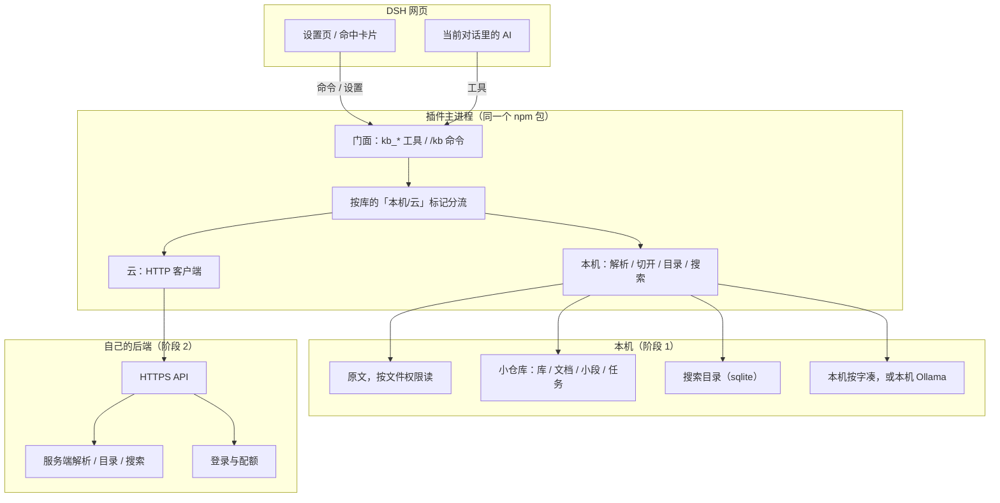

# DSH 知识库插件 · 能不能做、建议怎么做

> 日期：2026-08-30  
> 版本：v0.1.4  
> 形态：一个 DSH 插件，分两半——主进程干活、网页里画界面；以后再加自己的云服务。  
> 能力往哪走（能搜到 / 看得出关系 / 能发现线索）：`design/2026-08-30-06-dsh-知识库三层方向指引.md`  
> 怎么搜、库大了怎么办：`design/2026-08-30-07-dsh-知识库检索策略与规模演进.md`、`design/2026-08-31-01-dsh-知识库TB级架构.md`  
> 依据：DSH 官方插件说明、架构说明、存储说明；本机已有的 `dsh-lumina-tarot`；社区的 dsh-library、kb-rag、dsh-weknora。  
> 结论：**能做。做一个插件即可。本机和云共用同一套按钮和工具名，只换后面怎么存、怎么搜。先交付本机能断网搜索；云服务以后另起，插件改成访问它。**

怎么读：前面几节用人话讲「做什么、不做什么、为什么长这样」。中间的接口名、文件布局、任务编号是留给实现用的，不必一次啃完。

---

## 1. 我们要做什么

### 1.1 两个阶段（已经对齐过）


| 阶段             | 你当时的说法        | 本文的定义                                                                  |
| -------------- | ------------- | ---------------------------------------------------------------------- |
| **阶段 1 · 本机版** | 本地知识库，可离线用    | 导入、切开、做成能搜的目录、搜索，全在这台电脑上。**不依赖我们自己的云，也不把文档传到互联网。** 回答仍用 DSH 当前这场对话的模型。 |
| **阶段 2 · 云端版** | 云知识库，后端提供 API | **自己做后端**（不是包一层别人的产品）。插件变成访问这套 API 的客户端。人还是在 DSH 里问。这里的「云」= **放在服务器上的知识查询库**（和本机 `kb_search` 同一类事：按问题从库里取资料），不是再开一个聊天模型。默认仍是 search 取片段、当前对话模型写答案。 |


体验始终是同一套：把资料指进来（或传上去）→ 提问 → 从库里取出有用片段 → 模型作答并标出处。

「能搜」不够支撑「几份资料是什么关系」和「还有没有线索」。那两层怎么分期，见 06。第一期不要用「当前项目里查找」冒充知识库，也不要上完整知识图谱。

### 1.2 真正要交付的，是四条能力，不是 N 个知识库产品

后两条的节奏见 06：

1. **把各种文件变成能搜的小段**（抽文字 → 切开 → 做成目录）。
2. **按问题取出相关小段**（必须带来源）。
3. **让 DSH 里的 AI 用这些小段回答**（先搜再答，禁止没出处就编）。
4. **资料之间的关系和线索**（谁和谁一起出现、谁引用了谁；AI 再问一两轮邻居。第一版先把 1–3 做闭环）。

「很多种知识库」「很多种文件」是 **后面多几个适配器**，不是做很多个产品。阶段 1 先做一种：文档库，加上少数几种文件。

### 1.3 「离线」要拆成两句，免得误会成断网还能聊天

DSH 对话默认会用网上的大模型。不说清楚，用户会以为「离线知识库 = 拔网线也能聊」。


|            | 含义                    | 阶段 1 必须吗                                            |
| ---------- | --------------------- | --------------------------------------------------- |
| **知识库离线**  | 文档、目录、搜索不访问外网。拔网线还能搜。 | **必须。** 这是「离线版」的验收线。                                |
| **聊天模型离线** | 写答案的模型也在这台电脑上。        | **不绑在这个插件上。** 看你的 DSH 配置有没有本地模型。插件只保证：搜索这条路自己不主动联网。 |


验收请写成：**拔掉网线，导入和搜索仍然成功**；对话能不能写成一篇完整回答，取决于有没有本地大模型。设置页用一句话说明，不要假装插件自带了一个离线聊天模型。

### 1.4 阶段 1 明确不做

- 不做独立网站、独立网页路由（DSH 网页没有给第三方页面的座位）。  
- 不改 DSH 外壳的内部结构。  
- 不把知识库存在浏览器的本地存储里（持久数据必须在主进程）。  
- 不把对话里拖进去的图片，当成通用文档库。  
- 不做多人账号、计费。  
- 不把 WeKnora、dsh-library 当交付物；可以学它们工具长什么样，不要把它们 fork 进本仓库当运行时。

---


## 2. 对照现在的 DSH：为什么要这样切


### 2.1 一个插件包，两半一起装

```
一个 npm 包
  ├─ 主进程（Host）     能做什么：导入、搜索、工具、后台任务
  ├─ 网页（Client）     画成什么样：设置页、命中卡片
  └─ 一行配置           告诉 DSH 把两半都装上
          ↓
     dsh plugin add
          ↓
     你的 DSH 配置
          ↓
     跑起来的主进程 +（Web 版下的）界面
```


| 半边      | 跑在哪                  | 本项目放什么                          |
| ------- | -------------------- | ------------------------------- |
| **主进程** | `dsh web` 那个 Node 进程 | 本机引擎或云客户端、给 AI 的工具、斜杠命令、设置、导入任务 |
| **网页**  | 浏览器里的 DSH 壳          | 知识库设置页、导入入口、进度、搜索命中卡            |


浏览器 **不能** 直接调 AI 工具。抽文字、写目录、访问云，只能在主进程。网页只往官方预留的座位上插界面，再回头请主进程干活。

没有界面的用法（只跑主进程）仍然能让模型调 `kb_*` 工具。这是对的，不要为这种用法再开一套 HTTP。

### 2.2 只用 DSH 已经提供的座位


| 你想做的      | 用现成的什么                 | 怎么用                                                      |
| --------- | ---------------------- | -------------------------------------------------------- |
| AI 搜索、问答  | 主进程注册工具（**本插件提供，内核没有**） | 见 §3.4：`kb_ingest` / `kb_search` 等；云上再注册 `kb_ask` |
| 人点按钮、敲命令  | 主进程注册命令，网页去执行          | `/kb ingest` `/kb search` `/kb status`                   |
| 管理界面      | 设置页座位，自己画一块侧栏          | 独立侧栏叫「知识库」，不要挤在插件窄卡片里                                    |
| 对话里的命中列表  | 工具结果卡片，按工具名对上          | 出处、分数、打开原文                                               |
| 先搜再答的规矩   | Skill + 系统提示里加一节       | 没有命中不得说「根据知识库」；必须带 `[n]`                                 |
| 库、文档、任务状态 | 插件小仓库（键值存储，建议走 sqlite） | 不要把整本 PDF 塞进去                                            |
| 原文大文件     | 文件读写 + 插件自己的数据目录       |                                                          |
| 选文件夹导入    | 官方选目录                  | 本机导入的主路径，比网页上传更贴 DSH                                     |
| 导入很慢      | 后台任务                   | 解析在后台跑，界面看进度                                             |
| 本机语义模型    | 子进程（参数数组，禁止走系统 shell）  | Ollama 等                                                 |
| 云 API 密钥  | 凭据槽                    | 阶段 2；不要写进设置明文                                            |
| 本机预览小文件   | 本机小服务                  | 仅本机预览；**不要**当成通用上传入口                                     |
| 悬浮按钮      | 可选                     | 阶段 1 可以不做，有设置页就够                                         |


下面这些做了会在桌面版或远程浏览器上坏掉：

- 网页自己开一套 `/api/kb/*` 当主通路。  
- 猜座位名字、改外壳的私有结构。  
- 界面先显示「已经保存」，主进程还没确认。  
- 在文件顶层就启动后台活；主进程资源必须能随插件卸载而停。


### 2.3 存储上的硬限制（和知识库特别相关）

插件小仓库是「键 → 值」，**没有**专门存大文件、存向量的格子：

- 名字必须像安全的文件名 / 数据库名。  
- 一次写入是完整的；同一域里两笔写入不会自动排队——导入必须插件自己排成一条队。  
- 读的是内存里的快照；写是先落盘再改内存再通知。  
- 向量若本机要存，只能当成普通记录，或自己另管一张表。大文件不要塞进这个小仓库。  
- 整份 JSON 文件只适合偶尔改；搜索目录这种经常更新的，应走 sqlite。  
- 版本对不上就直接失败，没有自动升级——版本号从 1 开始就要当长期格式。

对话里的图片附件，和「用户导入的知识文档」不是同一条路。不要混用。

### 2.4 社区已经有的：学样子，不当底座


| 项目            | 做什么                        | 和我们的差                                    |
| ------------- | -------------------------- | ---------------------------------------- |
| `dsh-library` | 本机 md/txt，路径导入，默认 hash     | **最接近阶段 1**。无管理页、无 PDF、无云。详见 02。         |
| `kb-rag`      | 本机 PDF / Zotero，旁边挂 Python | 论文向。安装要 Python 和模型下载，和「一条命令装上」摩擦大。详见 03。 |
| `dsh-weknora` | 连接已有的 WeKnora，四个只读工具       | 云遥控器的先例。**不能导入。** 云是别人的。详见 04。           |


若只做「对话里搜本地 md」，装 dsh-library 就够，不必新开仓库。要新开，是因为它们都不覆盖这四件（第 4 件见 06）：

1. 同一套工具，后面能从本机引擎换成自己的云 API（阶段 2 不换脸）。
2. 多种库、多种文件，用适配器扩展，而不是只有一种 md 管道。
3. 给人点的管理页（建库、导入、进度、出处卡）。
4. 看得出关系、能发现线索（不是完整知识图谱）。

---


## 3. 推荐形态：一个插件，两套「后面怎么干」


### 3.1 总图

人话：网页和 AI 都只跟插件的门面说话。门面按这个库标的是「本机」还是「云」，把活分给本机引擎或 HTTP 客户端。




阶段 1 **不要实现真正的云 HTTP**（可以留接口，调用时明确说还没做）。阶段 2 打开即可，工具的名字和参数不变。

### 3.2 仓库建议


| 仓库                  | 职责             | 何时出现     |
| ------------------- | -------------- | -------- |
| `dsh-knowledge`（插件） | 主进程引擎/客户端 + 网页 | 现在       |
| `knowledge-api`（后端） | 独立服务：登录、导入、搜索  | 阶段 2 开工时 |


插件包名不要用 `@deepseek-ai/*`。配置里只插入 **一行** 主进程插件，名字等于 npm 包名。标明给 Web 用。禁止依赖工作区内部包。

建议文件按职责拆开（对齐 lumina，单个文件尽量不超过大约 300 行）：

```
dsh-knowledge/
├── package.json
├── cordis.patch.yml
├── src/
│   ├── index.ts                 # 装上：设置 / 工具 / 命令 / skill
│   ├── settings-schema.ts
│   ├── tools.ts
│   ├── commands.ts
│   ├── skill.ts
│   ├── facade.ts                # 统一找后面的引擎
│   ├── backend/
│   │   ├── types.ts             # 本机和云共同遵守的接口
│   │   ├── offline.ts
│   │   └── cloud.ts             # 阶段 1 可以是空实现
│   ├── parse/                   # 各种文件 → 文字/表格
│   ├── chunk/
│   ├── embed/
│   ├── index/                   # 搜索
│   └── domain.ts                # 小仓库有哪些表
└── src/client/
    ├── index.ts
    ├── settings/                # 建库、导入、列表、本机/云切换
    └── toolview/                # 搜索 / 云问答的卡片
```


### 3.3 核心接口（阶段 1 定下来，阶段 2 不得改含义）

```ts
type BackendKind = 'offline' | 'cloud'

interface KnowledgeBase {
  id: string
  name: string
  kind: 'document' | 'structured' | 'notes' | 'code'  // 可扩
  backend: BackendKind
  createdAt: number
}

interface KnowledgeBackend {
  listBases(): Promise<KnowledgeBase[]>
  createBase(input: { name: string; kind: KnowledgeBase['kind'] }): Promise<KnowledgeBase>
  ingest(input: {
    baseId: string
    source: LocalPathSource | CloudUploadHandle
  }): Promise<IngestJob>
  listDocuments(baseId: string): Promise<DocumentMeta[]>
  removeDocument(baseId: string, documentId: string): Promise<void>
  search(input: {
    baseId: string
    query: string
    topK?: number
  }): Promise<SearchHit[]>  // 每条带来源 / 位置 / 分数 / 原文
}
```

本机 **不要** 再调一轮网上的模型来写答案。本机路径：搜索把命中交给当前 AI，由这场对话的模型写。云库的主力仍是同一条路：`kb_search` 去查服务器上那份资料库，片段拿回来还是当前对话模型写。`kb_ask` 可选，查的也是同一份库，不是另找一个云端聊天机器人。

### 3.4 工具和命令（给模型用的名字要稳定）

**这些 `kb_*` 不是模型自带的，也不是 DSH 内核自带的。** 装上 DSH 之后，模型只会项目里查找（`grep` / `glob` / `read`）。知识库这一套，要等 **我们这个插件在主进程里注册工具** 之后，当前这场对话的模型才会在工具列表里看见它们、才会去调。

人话：模型是「会用别人递给它的工具」；工具从哪来、叫什么，是插件的事。网页上的设置页、斜杠命令是给人点的另一扇门，干的是同一套活。

名字从哪来、和别人的差在哪：

| 谁提供 | 模型能调到什么 | 什么时候有 |
|--------|----------------|------------|
| DSH 内核 | `grep` / `glob` / `read` | 装 DSH 就有，只看当前项目 |
| 别人的插件 | `library_search`、`weknora_search`、kb-rag 的 `kb_search` 等 | 装了那个插件才有 |
| **我们这个插件** | 下表的 `kb_*` | **我们自己 `ctx.tools.register` 注册**；卸插件就消失 |

`kb_` 是我们选定的前缀，用来和 `library_*`、`weknora_*` 错开。kb-rag 也用了 `kb_`（见 03），自研包进同一套 DSH 配置时要注意别撞名，必要时加前缀。口里说的「列库」对应实现上的 `kb_list_bases`（以及只列文档、不含正文的 `kb_list_documents`），不要理解成内核里已经有一个叫 `kb_list` 的工具。

注册方式走官方座位：主进程 `ctx.tools.register(defineTool(...))`。阶段 1 不注册 `kb_ask`（或注册了就失败并提示先搜索）；只有库标记为云、对面真有这份查询库时才打开。

#### 四个主力干什么用

这四个是给 **DSH 里的 AI 调的**，用来完成「进库 → 查找 → 回答」。人在设置页、斜杠命令里点的是同一套能力的另一扇门。和内核的 `grep` 不是一回事：`grep` 只在当前项目里找字；这些管的是 **已经导入的知识库**。

这里的「云」请按 **查询库** 来理解，不要按「网上再找一个会聊天的模型」来理解：资料和能搜的目录放在服务器上，工具按问题去查，和本机 `kb_search` 是同一类能力，只是库不在这台电脑上。

| 工具 | 做什么用 | 谁会调 |
|------|----------|--------|
| **列库**（实现名 `kb_list_bases`） | 看看现在有哪些知识库：本机还是云、叫什么、大概多少篇。问「搜哪个库」之前先用它。 | AI；设置页列表也是同一份数据 |
| **`kb_ingest`（导入）** | 把资料放进某个库。本机是给文件路径；云上是上传到那份远程查询库。不做这一步，库是空的，后面搜不到。 | AI，或人在设置页 / `/kb ingest` |
| **`kb_search`（搜索）** | 按问题从知识库里取出相关原文片段，带文件名和 `[n]` 出处。本机查本机目录；云库查服务器上那份查询库。**问答的主力**：搜完由当前对话模型写答案。 | AI（没有搜到就不能说「根据知识库」） |
| **`kb_ask`（只对云库）** | 还是查 **同一份** 云上的知识查询库，不是拿题目去问通用云端 AI。和 search 同类：问题进库，出来的是库里的证据和出处。差别只是可选由服务端把多段查库结果整理成一篇，避免和当前对话模型各写一篇。本机没有这份远程库，**不注册**（或调用就失败，改去 `kb_search`）。 | 只在云库；题目要跨很多篇、希望一次拿回「查库后的整理稿」时再用 |

串起来：

```text
ingest 把资料放进库（本机目录，或云上的查询库）
    → list 确认库还在、有哪些
    → search 按问题从这份库取出几段原文
    → 当前这场对话的模型根据这几段写回答（本机、云库默认都这样）
    → 可选 ask：仍查同一份云查询库，由服务端按查库结果整理成一篇带出处的回答
```

完整名单里还有：只列文档、不含正文的 `kb_list_documents`；删除并抽查残留的 `kb_remove`；以及 06 里第 ② 层、可以比搜索晚做的 `kb_related`（这篇还连着什么）、`kb_list_entities`（库里能追踪的对象）。


| 名称                  | 人话                  | 本机            | 云                 |
| ------------------- | ------------------- | ------------- | ----------------- |
| `kb_list_bases`     | 有哪些库（本机还是云、哪种库、多少篇） | ✓             | ✓                 |
| `kb_ingest`         | 导入。本机参数是 **文件路径**   | ✓             | 阶段 2：先拿上传地址或走后端上传 |
| `kb_list_documents` | 有哪些文档，不回正文          | ✓             | ✓                 |
| `kb_remove`         | 删除，并抽查索引里有没有残留      | ✓             | ✓                 |
| `kb_search`         | 搜索，返回带 `[n]` 的段落    | ✓             | ✓                 |
| `kb_related`        | 这篇或这个对象的邻居          | 搜索闭环之后做       | ✓                 |
| `kb_list_entities`  | 库里能追踪的对象，方便收窄再问邻居   | 同上            | ✓                 |
| `kb_ask`            | 只对云查询库：仍是查库；可选由服务端按查库结果整理成一篇 | 不注册，或失败并提示先搜索 | ✓                 |
| `/kb status`        | 导入任务进行到哪            | ✓             | ✓                 |
| `/kb ingest <path>` | 人从界面或命令导入           | ✓             | 阶段 2              |


硬规则：没有搜索命中，不得说「根据知识库」；答案必须能指回 `[n]`；库里没有就明说没有。谈关系和线索必须有邻居工具的结果，不得用模型记忆编关系。细则见 06。

---


## 4. 阶段 1 · 本机版


### 4.1 怎样算「知识库离线」过关

在没有外网时：

1. 能建一个标记为「本机」的文档库。
2. 能从本机路径导入至少 md / txt（第一版）；PDF 放到下一小版。
3. 搜索能返回带文件名和片段的命中。
4. 插件进程 **没有** 向我们自己的云、或网上的向量接口发请求（本机 Ollama 的 127.0.0.1 除外）。
5. 卸插件不自动删索引；设置页提供「清空本库」。

「聊天模型也在本机」写成配置说明，不进插件必过项。

### 4.2 资料怎么进库（不要做成网页网盘）

DSH 不是网盘。最贴合现有权限的导入顺序：


| 优先级   | 怎么进                                                        | 为什么                  |
| ----- | ---------------------------------------------------------- | -------------------- |
| 先做    | 用户给出本机路径，导入工具按文件权限去读                                       | 和 dsh-library 一样，能审计 |
| 先做    | 人选一个文件夹，主进程按允许的后缀批量导入                                      | 真正的「导入资料夹」，断网可用      |
| 可以后做  | 设置页选小文件（建议不超过 5MB）：网页选文件往往没有稳定路径，需要主进程提供「收下这串字节」的命令，体积必须封顶 |                      |
| 第一版不做 | 把拖进对话框的图片直接当知识文档                                           | 那是会话图片，不是库           |


浏览器大文件上传和桌面版的本地页面容易打架：不要把本机小服务的 POST 当主设计。以后若做，仅限本机打开的 DSH 网页，并在说明里写清。

### 4.3 本机用什么引擎（建议）


| 组件     | 建议                                | 备选                | 不要                    |
| ------ | --------------------------------- | ----------------- | --------------------- |
| 库和文档清单 | 插件小仓库，走 sqlite                    | 整份 JSON 仅调试       | 再做一套巨大的设置 JSON        |
| 原文     | 导入时拷一份到插件目录，或记下路径并经常检查还在不在        | 只记路径省空间，但文件一挪就坏   | 只记路径且从不检查             |
| 按字搜索   | sqlite 全文检索，或自己做词的目录              | 每次打开全库扫一遍         | 没有按字、只靠 hash          |
| 按意思    | 第一版可以没有；占位可用 hash（弱）；更好是本机 Ollama |                   | 默认打网上的向量接口（破坏「知识库离线」） |
| md/txt | 主进程里纯 JS                          | —                 | 为了 md 去装 Python       |
| PDF    | 下一小版：选不绑原生库的 JS，或可选本地命令           | kb-rag 那种 PyMuPDF | 第一版就承诺「任意格式」          |
| 很慢的编码  | 后台一条队列                            | —                 | 同步卡住 AI 这一轮           |


对外说明：hash 是按字凑合，换个说法就弱；要懂意思，在设置里改成本机 Ollama。怎么搜、本机容量上限见 07；库大到很多 TB 见 31-01。

### 4.4 「很多种知识库」怎么建模

种类是 **切开和搜索的策略不同**，不是做很多个产品：


| 种类  | 典型资料                  | 怎么切           | 搜索更看重      | 阶段    |
| --- | --------------------- | ------------- | ---------- | ----- |
| 文档  | md / txt / pdf / docx | 按窗口滑 + 记下标题路径 | 按字和按意思一起   | 1     |
| 表格类 | csv / json / xlsx     | 按行，保留列名       | 关键词 + 精确字段 | 1 可后做 |
| 笔记  | 短笔记、日记                | 整篇或按小标题       | 越近越重要      | 2     |
| 代码  | 仓库                    | 按符号/文件        | 路径和标识符     | 2     |


阶段 1 只实现文档。种类字段先写进结构，避免阶段 2 再搬家。

### 4.5 第一版承诺哪些文件，哪些只留接口


| 类型                       | 第一版               | 做法                |
| ------------------------ | ----------------- | ----------------- |
| `.md` `.txt` `.markdown` | 做                 | 当文本读              |
| `.pdf`                   | 接口留下，实现放到下一小版     | 扫描件标「需要认字」，不要假装抽过 |
| `.docx`                  | 后做                | 当压缩包解开再抽          |
| `.csv` `.json`           | 后做                | 走表格类              |
| `.png` `.jpg`            | 不进库               | 可提示「对话附件不是知识库」    |
| 网址 / 网页                  | 本机版 **默认拒绝**（要联网） | 云端以后可做            |
| 文件夹                      | 做                 | 后缀白名单 + 单库篇数和体积上限 |


每种解析器实现同一个口：丢进去字节和文件名，吐出来纯文本，外加可选的表格行、标题、页码。搜索引擎只吃这个统一结果，不直接吃原始文件类型。

### 4.6 网页上给人看什么（阶段 1）

只挂 **一个** 设置侧栏，名字叫「知识库」。不要同时再挂一份挤在插件列表里的窄卡。

页面建议分成：

1. 库列表（本机/云徽章；阶段 1 云按钮灰掉，写「阶段 2」）
2. 当前库：文档列表、删除、清空
3. 导入：选文件夹 / 填路径 / 添加小文件
4. 任务：进行中 / 失败（断连、失败必须看得见）
5. 检索试验：一个输入框直接搜，不经过模型（方便验收「断网还能搜」）
6. 「按意思」用 hash 还是 Ollama；Ollama 连不上就保持 hash 并提示
7. 关于：知识库离线 vs 聊天模型离线、数据放在哪个目录

对话里：搜索工具的卡片展示命中。「用这些回答」不是网页去调模型，而是用户继续在对话框说，或把命中写进当前对话（对标 dsh-library 的注入）。

远程打开、又不是本机地址时，设置可能不能写：页面改成只读说明。知识库正文不走设置（设置只放偏好：默认库、用哪种编码、一段多长）。

### 4.7 本机也有安全问题

- 只读用户指定的路径；写入仅限插件数据目录和自己的小仓库。  
- 后缀白名单；解析后的路径必须仍在允许的根目录下，防止通过快捷方式逃出去。  
- 单文件、单库上限（可以先对标 dsh-library 的 5MB，文件夹另给总上限）。  
- 外部编码命令：参数数组，不走系统 shell，超时和输出大小封顶。  
- 给模型的是切好的小段，不要把整本 PDF 一次塞回去。  
- 不把路径、那串数字写进聊天记录；可以记文档编号级的审计。

---


## 5. 阶段 2 · 自己的云 API


### 5.1 定位

云是 **独立的后端服务**，对外首先是一份 **可查询的知识库**（和本机 search 同类），不是在 DSH 插件进程里再开一个公网端口，也不是再托管一个聊天模型给用户闲聊。插件的云这一半只做：

- 从凭据槽取出令牌  
- 用 HTTPS 调约定好的接口  
- 把返回值映射成本机同一套「命中 / 文档信息」

DSH 的本机小服务继续只服务本机界面，不承担云。

库很大以后，原文、登记簿、检索目录怎么分，查询怎么一层层缩小，见 31-01。那些不在插件里做。

### 5.2 建议的接口面（和主进程接口一一对应，方便两套一起跑）

前缀示例：`https://api.example.com/v1`


| 方法     | 路径                            | 对应前面的接口              |
| ------ | ----------------------------- | -------------------- |
| GET    | `/bases`                      | 列库                   |
| POST   | `/bases`                      | 建库                   |
| GET    | `/bases/:id/documents`        | 列文档                  |
| DELETE | `/bases/:id/documents/:docId` | 删文档                  |
| POST   | `/bases/:id/ingest`           | 创建导入任务（直接上传，或先拿上传地址） |
| GET    | `/jobs/:id`                   | 任务状态                 |
| POST   | `/bases/:id/search`           | 搜索（查这份云查询库，返回片段） |
| POST   | `/bases/:id/ask`              | 可选：仍查同一份库，按查库结果整理成一篇带出处的回答 |


登录：Bearer。出错只回状态码和服务端原因，**不回**令牌。搜索超时大约 30 秒；若开了 ask（按查库结果整理成一篇），可以更长。

不要让 DSH 把 200MB 的 PDF 经工具参数塞进模型。正确顺序：界面或主进程把文件直接传到 API（或先拿一张限时上传票），工具只传文档编号。

### 5.3 从阶段 1 走到 2，什么不能破坏

- 工具名、参数名、命中字段，在阶段 1 就按云也能用的最小集合来设计。  
- 每个库标明是本机还是云；同一界面可以列出两种库，**禁止**一个库一半本地一半云还当成同一个编号。  
- 不自动把本机库悄悄同步到云（那是单独的产品决定，要有「发布到云」这种明确动作）。  
- 本机小仓库永远不当成云的源，除非用户明确导出。


### 5.4 阶段 2 插件要改的面（预期很小）

- 实现云这一半（对面是知识查询库，不是通用聊天）  
- 设置里增加 API 地址，以及「凭据配好了没有」（真密钥走凭据槽）  
- 云库才注册 `kb_ask`（查的仍是这份库）  
- 云库禁用「只给本机路径」，改为上传到那份查询库  
- 若用了 ask，出处必须能指回查库命中；默认问答仍走 `kb_search`

多人、大文件仓库、排队、扫描件认字，不在 DSH 插件里做。

---


## 6. 可不可行


### 6.1 判断


| 问题             | 判断                                            |
| -------------- | --------------------------------------------- |
| 做成 DSH 插件？     | **可以。** 必须两半都有；数据和搜索在主进程。                     |
| 阶段 1 本机离线？     | **知识库离线可以。** 小仓库 + 读文件 + 本机编码，已有先例。           |
| 多种库 / 多种文件？    | **可以，但必须分期。** 接口一次设计，实现先文档 + md/txt。          |
| 阶段 2 自己的 API？  | **可以。** 和 weknora 只读插件同构，差别是 API 是自己的，而且要能写入。 |
| 浏览器当网盘上传任意大文件？ | **阶段 1 不能当主路径。** 用路径/选目录；小文件再开「收下字节」。         |


### 6.2 主要风险


| 风险                      | 影响            | 怎么降                                      |
| ----------------------- | ------------- | ---------------------------------------- |
| Harness 还在预览，座位和存储可能改   | 插件跟版本碎        | 钉死目标 DSH 版本；对照 lumina 的插法；升级单独验证         |
| hash 很弱，用户觉得知识库没用       | 产品失败          | 说明里写清；设置可一键用 Ollama；用固定 20 问测能不能搜到（见 07） |
| 为「任意格式」过早引入原生库 / Python | 安装失败          | 第一版纯 JS；重的解析走可选外部命令                      |
| 用本机小服务收大文件 POST         | 桌面版 / 远程浏览器断  | 不作为主路径                                   |
| 小仓库并发乱写                 | 目录损坏          | 导入单队列，后台任务串行                             |
| 和 dsh-library 看起来像重复造轮子 | 被问「为什么不直接装那个」 | 说明里写差异：管理页 + 多种资料 + 预留自己的云 + 关系和线索       |
| 「离线」被理解成断网聊天            | 预期管理失败        | 设置页和本文 §1.3                              |


### 6.3 明确不做的替代方案


| 方案               | 为何不做                               |
| ---------------- | ---------------------------------- |
| 只做网页，索引放浏览器里     | 没有工具、没有无界面用法、换浏览器就丢，和「主进程拥有持久数据」相反 |
| 阶段 1 就上云后端       | 违背「先做本机版」；检索和界面还没验证就背上运维           |
| 插件内嵌 WeKnora     | 那是别人的云；官方插件还只读                     |
| 每种知识库一个 npm 包    | 安装和座位会冲突；用种类 + 解析器扩展点即可            |
| 改 DSH 内核加「知识库座位」 | 上游周期不可控；现有设置页 + 命中卡片够第一版           |
| 第一版上图数据库 / 整库抽图谱 | 破坏知识库离线；关系用本机瘦表 + AI 再问一两轮即可（06）   |
| 用当前项目查找代替知识库     | 那是读代码；资料问答要明确导入 + 出处（05、06）        |


---


## 7. 建议干活顺序

原则：**前一档验收没勾完，不进入下一档。**


| 档       | 交付                            | 怎样算过                              |
| ------- | ----------------------------- | --------------------------------- |
| **P0**  | 能装上的空包（两半都有）                  | 一条命令装进 Web 配置；配置导出里看得到；主进程和网页都加载了 |
| **P1**  | 小仓库 + 建库/列表                   | 重启后库还在；无界面用法不报界面错误                |
| **P2**  | 本机：md/txt 导入 + 按字搜索（hash 仅占位） | 拔网线还能搜到                           |
| **P3**  | 工具 + 规矩 + 搜索卡片                | 对话问库里的事实会去搜，并带 `[n]`              |
| **P4**  | 选文件夹批量导入 + 进度                 | 大文件夹不卡死界面；失败看得见                   |
| **P5**  | 可选本机 Ollama                   | 没装时退回按字 / hash，不崩溃                |
| **P5b** | 关系表 + 问邻居（06 ②）               | 没有邻居就空着；有一起出现或写明引用则能指回片段          |
| **P5c** | 再问一两轮找线索（06 ③）                | 问关联/线索会去问邻居，不编                    |
| **P6**  | PDF（失败要说清楚）                   | 带文字层的 PDF 能搜到；扫描件不要假装成功           |
| **P7**  | 冻结合约草稿（还不开服务）                 | 字段和前面的接口对齐                        |
| **P8**  | 云服务最小版 + 插件云这一半               | 同一界面能切到云库；密钥走凭据槽；断网时云库失败信息明确      |


P0–P5 是可发布的本机搜索第一版。P5b–P5c 是同一产品上的关系和线索（①没过不排）。P6 起是文件种类。P7–P8 才是云。方向见 06。

### 7.1 工作量量级（供排期，不是承诺）

按一人、已经做过类似双面插件估：

- P0–P1：2–4 天  
- P2–P3：1–1.5 周  
- P4–P5：3–5 天  
- 说明 / 安装 / 配置导出验收：2 天

云后端单独按服务复杂度排，**不要**和插件第一版捆在同一个里程碑。

---


## 8. 开工前默认值（你不定就按这个）

1. **目标 DSH 版本**：跟当前本机、lumina 所用的那条预览线，开工前用配置导出钉死。
2. **包名**：`dsh-knowledge`。
3. **第一版必须有 PDF 吗**：默认否，只 md/txt + 文件夹。
4. **本机 Ollama 算不算「知识库仍离线」**：默认算（只连 127.0.0.1）。
5. **阶段 1 要不要假的云服务**：默认只把接口和草稿写下，不启动服务。
6. **多个人共用一台 DSH**：默认就你自己用这台电脑；云阶段再谈租户。

---


## 9. 参考

- 插件怎么写：[https://dsh.pub/develop-plugin.md](https://dsh.pub/develop-plugin.md)  
- 工具入门：[https://deepseek-harness.github.io/deepseek-harness/en/develop/basic/](https://deepseek-harness.github.io/deepseek-harness/en/develop/basic/)  
- 存储：[https://deepseek-harness.github.io/deepseek-harness/en/reference/subsystems/storage](https://deepseek-harness.github.io/deepseek-harness/en/reference/subsystems/storage)  
- 双面先例：`dsh-lumina-tarot/design/2026-08-19-01-系统设计.md`  
- 本机文档库先例：[https://github.com/PerryLink/dsh-library](https://github.com/PerryLink/dsh-library)  
- 云只读先例：Tencent WeKnora 的 DSH 插件  
- 三件事（能搜到 / 看得出关系 / 能发现线索）：`design/2026-08-30-06-dsh-知识库三层方向指引.md`  
- 写代码不会自动进库：`design/2026-08-30-05-dsh-写代码不会自动建知识库索引.md`  
- 检索怎么做、做到多大换方案：`design/2026-08-30-07-dsh-知识库检索策略与规模演进.md`  
- 库很大以后怎么存、怎么搜：`design/2026-08-31-01-dsh-知识库TB级架构.md`

---


## 10. 变更记录

- v0.1（2026-08-30）：首稿。本地 = 知识库不联网；云端 = 自己的后端 API。  
- v0.1.1（2026-08-30）：补上关系和线索；工具预留问邻居。细则见 06。  
- v0.1.2（2026-08-30）：检索质量见 07。  
- v0.1.3（2026-08-31）：TB 见 31-01。  
- v0.1.4（2026-08-31）：全文改成和 07、31-01 同一套更好读的说法。结论、工具名、接口、任务编号不变。  
- v0.1.5（2026-08-31）：§3.4 写明 `kb_*` 由本插件注册，不是模型或内核自带。  
- v0.1.6（2026-08-31）：§3.4 补上四个主力干什么用、怎么串起来。  
- v0.1.7（2026-08-31）：「云」= 远程知识查询库，和 search 同类；`kb_ask` 不是另开云端聊天模型。

