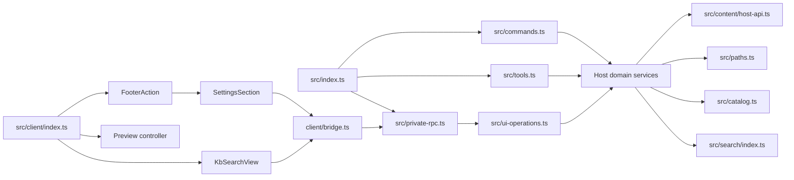

# dsh-知源源码模块化重构方案

<!-- maintained-by: human+ai -->

- **文档状态**：待评审
- **适用范围**：`src/` 下 Host、Client、content、search 代码的职责拆分
- **目标**：降低文件理解成本，明确模块边界，避免继续向大型文件堆积逻辑
- **非目标**：本方案不新增业务能力，不改变 RPC 字段、搜索协议、持久化格式或文件安全策略
- **分析基线**：当前工作区源码；记录提交 `8450a94`
- **工作区说明**：编写本文时工作区已有其他未提交代码、测试、构建产物和设计文档改动。后续实施必须先确认这些改动的归属，本方案不覆盖、不回滚、不替换它们。

## 1. 背景与问题

当前 `src/` 下的文件数量已经不少，但文件名和职责并不总是一一对应。部分文件同时承担编排、参数校验、文件系统操作、格式处理和 UI 展示，阅读者需要跨越较大的代码范围才能理解一条业务链路。

本次重构要解决的不是“文件数量太少”，而是以下问题：

1. **应用编排和领域实现混在一起**：例如 `ingest.ts` 同时处理源文件遍历、hash 去重、配额、路径安全、格式转换、写入和结果汇总。
2. **页面编排和展示混在一起**：例如 `SettingsSection.tsx` 同时管理 Tab、弹框、搜索请求、预览请求和 Host 操作。
3. **边界解析集中且命名过宽**：例如 `host-payload.ts` 集中解析 read、search、ingest、table page 等不同返回值。
4. **同一类纯函数和请求组装存在重复**：command、tool、Client RPC 各自拥有部分参数校验和请求构造逻辑。
5. **领域 DTO 归属不够清晰**：`types.ts`、`content/api.ts`、`client/models.ts` 之间存在转出和交叉依赖。
6. **搜索展示存在重复编排**：设置弹框和 toolview 都有 overview/detail/hit 展示，但搜索状态逻辑分散在不同组件内。

## 2. 当前源码基线

### 2.1 文件规模

当前没有 `src/` 源文件超过 300 行，但以下文件已经接近上限或职责明显混合：

| 文件                                             | 当前规模 | 主要职责                                                   | 重构优先级 |
| ------------------------------------------------ | -------: | ---------------------------------------------------------- | ---------- |
| `src/ingest.ts`                                  |   299 行 | 导入编排、遍历、hash、配额、路径、格式准备、写入、结果汇总 | P0         |
| `src/bases.ts`                                   |   273 行 | 知识库生命周期、目录树、条目读写                           | P0         |
| `src/client/settings/styles.ts`                  |   274 行 | 注入式工作台样式字符串                                     | 暂不拆     |
| `src/client/settings/SettingsSection.tsx`        |   261 行 | 工作台状态、搜索、预览、弹框、Host 调用                    | P0         |
| `src/content/markdown/client/MarkdownEditor.tsx` |   254 行 | 编辑器生命周期、工具栏、高亮、滚动定位                     | P1         |
| `src/tools.ts`                                   |   229 行 | 工具注册、参数解析、Schema、渲染                           | P1         |
| `src/client/host-payload.ts`                     |   223 行 | 多类 Host 返回值解析                                       | P1         |
| `src/content/csv/server/csv-document.ts`         |   212 行 | CSV 解析、序列化、窗口和范围处理                           | P2         |
| `src/content/csv/client/CsvPreview.tsx`          |   212 行 | CSV 预览、表格展示、编辑状态                               | P2         |
| `src/client/settings/AdditionalDialogs.tsx`      |   209 行 | 导入弹框、拖拽和相关展示                                   | P2         |

`src/client/search/SearchOverviewCard.tsx` 当前约 61 行，职责主要是搜索概览卡展示，不作为第一批拆分对象。搜索 UI 的主要重复在 `SearchDialog.tsx` 和 `KbSearchView.tsx` 的状态及列表编排层。

当前工作区已经存在一部分未提交的搜索结构整理，不能在后续实施中重复创建同一职责的模块：

- `src/client/settings/search-actions.ts` 已抽出设置工作台的搜索请求、打开文件、分页历史和过期请求处理，后续应将它视为本方案中“工作台搜索编排模块”的现有实现，先评审和完善，不再机械新增第二个 `use-workbench-search.ts`。
- `src/client/search/SearchPagination.tsx` 已抽出搜索详情的上一页/下一页展示；后续共享搜索展示时优先复用或调整该组件，不再新增同名分页组件。
- `src/client/search/search-pages.ts` 已承载搜索页历史、cursor 和分页选择相关纯逻辑。

因此，本文中的 `use-workbench-search.ts` 是职责目标名，不是要求必须新建的文件；如果现有 `search-actions.ts` 已满足该职责，应保留现有命名，避免为了目录形式进行无意义改名。

### 2.2 当前运行链路



当前 Host 的总体依赖方向是可保留的：入口负责注册，应用操作负责分派，领域模块负责业务，content/path/scanner 负责底层能力。重构重点是把每层内部的混合职责拆开，而不是重新设计整条链路。

### 2.3 当前边界事实

以下行为必须在结构重构中保持不变：

- Host 是 catalog、知识库、文件、导入任务和工具执行状态的唯一持久化真相。
- Client 只能通过 Host bridge 进行建库、导入、检索、读写和删除，不直接扫描本机文件。
- 文件路径必须继续经过库根 containment 和符号链接逃逸检查。
- `op`、`baseId`、`destCategory`、`path`、`relPath` 等 RPC 和结果字段不得因内部改名而变化。
- 搜索 v3 cursor、overview/detail 分流、scanner contract 和 result DTO 保持兼容。
- `content/host-registry.ts` 继续作为 Markdown、CSV 等格式能力的路由入口。
- Client 的 pending、error、断连、取消和过期请求处理不能在拆分中丢失。

## 3. 重构目标与原则

### 3.1 重构目标

1. 入口文件只做装配和路由，不承载大段业务实现。
2. 每个模块通过文件名表达业务职责，不使用无语义的 `utils.ts`、`helpers.ts` 等命名。
3. 领域 DTO 只维护一份，Host 与 Client 通过明确的 contract 共享类型。
4. 纯函数、异步编排、文件系统边界和 UI 展示彼此可独立理解、测试和替换。
5. 每个阶段都能独立构建、验证和回滚，不把大量行为变更混入结构整理。

### 3.2 依赖原则

```text
Host/Client 入口
    ↓
应用层适配与操作分派
    ↓
领域服务
    ↓
content / search / catalog / path 安全边界
    ↓
文件系统、子进程或第三方格式库
```

Client 方向：

```text
Slot 组件入口
    ↓
页面或 toolview 编排
    ↓
业务 hook
    ↓
bridge 与 payload parser
    ↓
Host RPC
```

禁止出现以下依赖：

- content 的 Client renderer 反向依赖 Client 页面模型。
- 展示组件直接调用文件系统、递归扫描或本地持久化。
- search result/template 直接调用 scanner 或读取文件。
- scanner 引入 React、Client bridge 或格式展示代码。
- 低层 path/content 模块反向依赖 settings 页面。

### 3.3 兼容 facade 原则

第一阶段保留以下既有入口文件，先迁移实现，再逐步调整调用方：

- `src/types.ts`
- `src/catalog.ts`
- `src/bases.ts`
- `src/ingest.ts`
- `src/tools.ts`
- `src/ui-operations.ts`
- `src/client/host-payload.ts`
- `src/client/bridge.ts`

这些文件可以暂时只做 re-export 或薄编排，避免一次性修改整个依赖图。确认所有引用迁移完成后，再决定是否删除 facade。

## 4. 目标模块结构

以下是目标结构，不要求在一个提交中全部创建。带有“新增”标记的路径是建议路径，实施时应逐阶段落地。

```text
src/
├── contracts/                              # 新增：跨 Host/Client 的领域 DTO
│   ├── catalog.ts
│   ├── entry.ts
│   ├── ingest.ts
│   └── jobs.ts
│
├── catalog/                               # 新增：catalog 编解码与持久化
│   ├── catalog-codec.ts
│   ├── catalog-store.ts
│   └── catalog-mutators.ts
│
├── base/                                  # 新增：知识库与条目服务
│   ├── base-service.ts
│   ├── base-tree.ts
│   ├── entry-service.ts
│   └── file-stats.ts
│
├── ingest/                                # 新增：导入流水线
│   ├── ingest-service.ts
│   ├── source-walker.ts
│   ├── existing-content.ts
│   ├── ingest-policy.ts
│   └── prepare-entry.ts
│
├── rpc/                                   # 新增：Host RPC 应用操作
│   ├── operation-input.ts
│   ├── operation-dispatch.ts
│   └── operations/
│       ├── base-operations.ts
│       ├── entry-operations.ts
│       ├── ingest-operations.ts
│       ├── search-operations.ts
│       └── prefs-operation.ts
│
├── tools/                                 # 新增：工具注册与边界适配
│   ├── register-tools.ts
│   ├── tool-input.ts
│   ├── search-schema.ts
│   └── tool-render.ts
│
├── content/                               # 保留：格式能力与 Host/Client contract 边界
│   ├── api.ts
│   ├── client-api.tsx
│   ├── host-api.ts
│   ├── host-contract.ts
│   ├── host-registry.ts
│   ├── shared/
│   │   ├── file-hash.ts
│   │   ├── ingest-output.ts
│   │   ├── line-window.ts
│   │   ├── preview-focus.ts
│   │   ├── search-document.ts
│   │   ├── table-patch.ts
│   │   └── utf8.ts
│   ├── markdown/
│   │   ├── index.ts
│   │   ├── client/
│   │   └── server/
│   └── csv/
│       ├── index.ts
│       ├── client/
│       └── server/
│
├── search/                                # 保留当前顶层结构
│   ├── index.ts                           # 唯一公共入口
│   ├── detail-search.ts                   # 由 file-search.ts 细化
│   ├── hit-builder.ts                     # 新增：命中 DTO 构造
│   ├── match-groups.ts                    # 由 file-summary.ts 细化
│   ├── search-window-policy.ts             # 新增：窗口和预算纯函数
│   ├── scanner/
│   └── result/
│
├── client/
│   ├── bridge/
│   │   ├── rpc-client.ts
│   │   └── payload/
│   │       ├── guards.ts
│   │       ├── read-entry-payload.ts
│   │       ├── search-result-payload.ts
│   │       ├── ingest-result-payload.ts
│   │       └── table-page-payload.ts
│   │
│   ├── settings/
│   │   ├── SettingsSection.tsx
│   │   ├── use-workbench-actions.ts
│   │   ├── use-workbench-search.ts
│   │   └── WorkbenchDialogs.tsx
│   │
│   ├── search/
│   │   ├── SearchOverviewCard.tsx
│   │   ├── SearchFileDetailCard.tsx
│   │   ├── SearchHitCard.tsx
│   │   ├── SearchOverviewList.tsx
│   │   ├── SearchDetailList.tsx
│   │   └── SearchScanNote.tsx
│   │
│   └── toolview/
│       ├── KbSearchView.tsx
│       ├── use-kb-search-result.ts
│       └── tool-result-types.ts
```

## 4.1 目标结构职责说明

下面的“模块”既包括文件，也包括承担一组明确职责的目录。文件名表示业务职责，目录名表示依赖边界；目录不是为了凑数量而拆分。所有新增模块都应先从现有实现中移动代码，再改变 import，不在移动时顺便改变业务行为。

### 4.1.1 跨层类型：`contracts/`

| 模块                   | 作用                                                                                    |
| ---------------------- | --------------------------------------------------------------------------------------- |
| `contracts/`           | 存放 Host、Client 和 content 之间共享的领域 DTO；只描述数据，不执行文件操作或 UI 逻辑。 |
| `contracts/catalog.ts` | 描述 catalog、知识库卡片、偏好和类目相关数据结构。                                      |
| `contracts/entry.ts`   | 描述条目预览、完整读取、表格分页、命中定位和编辑结果。                                  |
| `contracts/ingest.ts`  | 描述导入输入、单文件导入结果、批次汇总和失败原因。                                      |
| `contracts/jobs.ts`    | 描述导入任务状态、任务进度、错误和完成结果。                                            |

### 4.1.2 Catalog 持久化：`catalog/`

| 模块                          | 作用                                                                    |
| ----------------------------- | ----------------------------------------------------------------------- |
| `catalog/`                    | 只负责 catalog 数据的编解码、串行写入和变更操作，不负责知识库文件内容。 |
| `catalog/catalog-codec.ts`    | 将未知 JSON 收窄为 catalog DTO，处理默认值、版本兼容和 warning。        |
| `catalog/catalog-store.ts`    | 负责 catalog 文件读取、临时文件写入、原子 rename 和单写者事务队列。     |
| `catalog/catalog-mutators.ts` | 负责知识库新增、更新、删除、别名清理和最近类目记忆等变更。              |

### 4.1.3 知识库与条目服务：`base/`

| 模块                    | 作用                                                                   |
| ----------------------- | ---------------------------------------------------------------------- |
| `base/`                 | 负责知识库生命周期、目录树和条目读写；不负责 RPC 参数解析。            |
| `base/base-service.ts`  | 负责知识库列表、创建、更新、删除、存在性检查和最近使用标记。           |
| `base/base-tree.ts`     | 负责扫描库内目录、构造树节点、识别文件/目录类型和计算展示统计。        |
| `base/entry-service.ts` | 负责条目读取、预览模式选择、表格分页、写入和删除。                     |
| `base/file-stats.ts`    | 承载文件数量、文字字节数等纯统计函数；只有确实能降低理解成本时才新增。 |

### 4.1.4 导入流水线：`ingest/`

| 模块                         | 作用                                                                                    |
| ---------------------------- | --------------------------------------------------------------------------------------- |
| `ingest/`                    | 将外部文件转换为知识库条目，负责导入流程编排，不负责 Client UI。                        |
| `ingest/ingest-service.ts`   | 读取 catalog 和目标库，编排批次导入，并汇总 copied、renamed、skipped、failed 等结果。   |
| `ingest/source-walker.ts`    | 将单文件或目录统一展开为源文件列表，处理递归遍历。                                      |
| `ingest/existing-content.ts` | 建立本次导入使用的已有内容 hash 快照，并统计当前库大小。                                |
| `ingest/ingest-policy.ts`    | 处理支持格式、源相对路径、目标路径、唯一文件名、错误码和配额规则。                      |
| `ingest/prepare-entry.ts`    | 调用 content registry 生成 PreparedEntry，执行重复判断、单文件/单库配额判断和安全写入。 |

### 4.1.5 RPC 应用层：`rpc/`

| 模块                                  | 作用                                                                                |
| ------------------------------------- | ----------------------------------------------------------------------------------- |
| `rpc/`                                | 负责不可信输入到 Host 用例的边界适配和操作路由，不直接实现 catalog 或文件系统细节。 |
| `rpc/operation-input.ts`              | 对 `unknown` payload 做对象、字符串、布尔值、正整数、数组和预览选项校验。           |
| `rpc/operation-dispatch.ts`           | 根据 `op` 把请求转发到对应的 operation handler，并统一处理边界错误。                |
| `rpc/operations/base-operations.ts`   | 装配 list、create、update、deleteBase 请求。                                        |
| `rpc/operations/entry-operations.ts`  | 装配 tree、read、readPage、write、deleteEntry 请求。                                |
| `rpc/operations/ingest-operations.ts` | 装配路径导入和拖入 bytes 导入，并将耗时任务交给 JobRunner。                         |
| `rpc/operations/search-operations.ts` | 装配初次搜索和 cursor 续页请求，不实现 scanner。                                    |
| `rpc/operations/prefs-operation.ts`   | 处理偏好读取、偏好写入、额度范围和默认知识库校验。                                  |

### 4.1.6 工具边界：`tools/`

| 模块                      | 作用                                                                         |
| ------------------------- | ---------------------------------------------------------------------------- |
| `tools/`                  | 负责 DSH tool 的注册、参数适配、输出 Schema 和文本展示；不承载底层搜索实现。 |
| `tools/register-tools.ts` | 向 DSH 注册 `kb_list_bases`、`kb_ingest`、`kb_search`。                      |
| `tools/tool-input.ts`     | 将工具参数从 `unknown` 收窄为领域请求，并提供工具专用错误信息。              |
| `tools/search-schema.ts`  | 描述 `kb_search` 的可序列化输出 Schema。                                     |
| `tools/tool-render.ts`    | 将领域结果渲染为工具文本块和 presentation metadata。                         |

### 4.1.7 内容格式层：`content/`

| 模块                                | 作用                                                                                    |
| ----------------------------------- | --------------------------------------------------------------------------------------- |
| `content/`                          | 统一 Markdown、CSV 等格式的导入、预览、搜索、写入能力，是领域服务和具体格式之间的边界。 |
| `content/api.ts`                    | 定义格式模块的公共类型、生命周期和能力接口。                                            |
| `content/client-api.tsx`            | 在 Client 侧根据条目内容类型选择 Markdown、CSV 等受控展示组件。                         |
| `content/host-api.ts`               | 提供 Host 领域层使用的稳定 facade，隐藏具体格式模块实现。                               |
| `content/host-contract.ts`          | 定义 Host 格式 handler 的输入、输出和读写能力契约。                                     |
| `content/host-registry.ts`          | 根据文件扩展名路由到对应 format module，不让业务层直接判断 Markdown/CSV。               |
| `content/shared/`                   | 放格式无关的 hash、行窗口、预览定位、搜索文档和表格 patch 纯函数。                      |
| `content/shared/file-hash.ts`       | 计算文件指纹，供导入去重和预览新鲜度判断使用。                                          |
| `content/shared/ingest-output.ts`   | 描述并写入格式 handler 产生的 PreparedEntry。                                           |
| `content/shared/line-window.ts`     | 计算命中行附近的文本窗口和展示范围。                                                    |
| `content/shared/preview-focus.ts`   | 根据行号、字节列和 source fingerprint 判断预览定位是否有效。                            |
| `content/shared/search-document.ts` | 将格式文件适配为搜索所需的文本、行号和 excerpt 数据。                                   |
| `content/shared/table-patch.ts`     | 描述表格编辑的稀疏 patch、revision 和冲突边界。                                         |
| `content/shared/utf8.ts`            | 提供 UTF-8 字节列和文本列之间的安全转换。                                               |
| `content/markdown/`                 | Markdown、纯文本导入、预览、搜索和写入的完整格式实现。                                  |
| `content/markdown/index.ts`         | 注册 Markdown 格式支持的扩展名和 handler。                                              |
| `content/markdown/client/`          | 提供 Markdown 预览和编辑 UI；只消费 Host 返回的数据。                                   |
| `content/markdown/server/`          | 负责 Markdown 导入准备、文本预览、搜索读取和写回。                                      |
| `content/csv/`                      | CSV 导入、表格预览、分页读取、搜索和编辑的完整格式实现。                                |
| `content/csv/index.ts`              | 注册 CSV 格式支持和 CSV handler 能力。                                                  |
| `content/csv/client/`               | 提供 CSV 表格预览、文本回退和编辑交互。                                                 |
| `content/csv/server/`               | 负责 CSV 编码识别、解析、序列化、分页、搜索和写入。                                     |

### 4.1.8 搜索层：`search/`

| 模块                             | 作用                                                                      |
| -------------------------------- | ------------------------------------------------------------------------- |
| `search/`                        | 负责一次搜索请求从规范化、扫描、分组、分页到结果 DTO 的 Host 流程。       |
| `search/index.ts`                | 搜索领域唯一公共入口，负责初次/续页分流、scope 解析和 cursor 补充。       |
| `search/detail-search.ts`        | 编排单文件详情搜索，按 cursor 位置读取并生成命中结果。                    |
| `search/hit-builder.ts`          | 将 scanner 原始命中和 SearchDocument 数据构造成稳定的 hit DTO。           |
| `search/match-groups.ts`         | 按文件分组、排序和汇总 scanner 命中。                                     |
| `search/search-window-policy.ts` | 处理命中窗口是否合并、字符预算和结果页预算等纯规则。                      |
| `search/scanner/`                | 提供可替换的扫描器契约和实现，只返回原始命中及扫描状态。                  |
| `search/result/`                 | 存放 overview/detail 结果 DTO、共享类型和结果模板，不启动扫描、不读文件。 |

### 4.1.9 Client bridge：`client/bridge/`

| 模块                                             | 作用                                                                      |
| ------------------------------------------------ | ------------------------------------------------------------------------- |
| `client/bridge/`                                 | 将 Client 组件和 Host RPC 隔离，统一处理断连、未知返回值和 payload 收窄。 |
| `client/bridge/rpc-client.ts`                    | 调用 private RPC endpoint，并将断连或 Host failure 转换为可展示错误。     |
| `client/bridge/payload/guards.ts`                | 提供不带业务副作用的基础结构判断函数。                                    |
| `client/bridge/payload/read-entry-payload.ts`    | 校验并解析条目预览、编辑和定位结果。                                      |
| `client/bridge/payload/search-result-payload.ts` | 校验并解析 overview/detail 搜索结果和 v3 cursor。                         |
| `client/bridge/payload/ingest-result-payload.ts` | 校验导入批次结果、文件状态、warning 和失败原因。                          |
| `client/bridge/payload/table-page-payload.ts`    | 校验 CSV 表格分页、revision 和 patch 相关结果。                           |

### 4.1.10 设置工作台：`client/settings/`

| 模块                                       | 作用                                                                                                                            |
| ------------------------------------------ | ------------------------------------------------------------------------------------------------------------------------------- |
| `client/settings/SettingsSection.tsx`      | 只负责工作台页面装配、Tab、Host hook 组合和组件回调连接。                                                                       |
| `client/settings/use-workbench-actions.ts` | 统一创建、编辑、删除、导入、偏好保存等工作台动作的 pending/error 处理。                                                         |
| `client/settings/use-workbench-search.ts`  | 目标职责是搜索请求、文件详情、分页和过期请求保护；当前工作区已有 `search-actions.ts` 承担该职责，优先完善现有模块，不重复创建。 |
| `client/settings/WorkbenchDialogs.tsx`     | 根据 `DialogKind` 选择并装配创建、编辑、导入、搜索、预览和确认弹框。                                                            |

### 4.1.11 搜索展示：`client/search/`

| 模块                       | 作用                                                              |
| -------------------------- | ----------------------------------------------------------------- |
| `client/search/`           | 只放搜索结果的展示组件和展示层分页，不直接调用 Host 或读取文件。  |
| `SearchOverviewCard.tsx`   | 展示文件概览、扫描覆盖度、文件命中数量和打开详情入口。            |
| `SearchFileDetailCard.tsx` | 展示单文件详情、文件级返回入口、命中列表和错误状态。              |
| `SearchHitCard.tsx`        | 展示单条命中、行号、excerpt 和打开预览入口。                      |
| `SearchOverviewList.tsx`   | 将概览文件列表从容器中抽出，负责稳定 key 和空态展示。             |
| `SearchDetailList.tsx`     | 将详情命中列表从容器中抽出，负责命中列表和空态展示。              |
| `SearchScanNote.tsx`       | 统一展示扫描未完成、结果为下限和 scanner warning。                |
| `SearchPagination.tsx`     | 展示搜索详情上一页/下一页按钮；当前工作区已有该组件，应优先复用。 |

### 4.1.12 Toolview：`client/toolview/`

| 模块                                      | 作用                                                                        |
| ----------------------------------------- | --------------------------------------------------------------------------- |
| `client/toolview/KbSearchView.tsx`        | 负责 tool block 到展示组件的装配，不再承载全部搜索异步状态。                |
| `client/toolview/use-kb-search-result.ts` | 管理 toolview 的 active result、AbortController、文件详情、分页和过期请求。 |
| `client/toolview/tool-result-types.ts`    | 定义 tool result block 的边界类型，不复制领域搜索 DTO。                     |

### 4.1.13 保留的入口与兼容 facade

以下现有文件不一定搬入目标目录，但在重构期间承担入口或兼容职责：

| 文件                         | 作用                                                                        |
| ---------------------------- | --------------------------------------------------------------------------- |
| `src/index.ts`               | Host 插件入口，只负责依赖注入、注册和生命周期清理。                         |
| `src/client/index.ts`        | Client 插件入口，负责 slot 注册、preview controller 装配和 Client cleanup。 |
| `src/commands.ts`            | 将命令行输入转发到 Host 用例，不复制领域实现。                              |
| `src/private-rpc.ts`         | 注册 private RPC endpoint，并统一序列化 Host 结果和错误。                   |
| `src/client/bridge.ts`       | 旧 bridge facade；迁移完成前继续导出 RPC 调用能力。                         |
| `src/client/host-payload.ts` | 旧 payload facade；迁移完成前继续 re-export 按类型拆分的 parser。           |
| `src/types.ts`               | 旧领域类型入口；contracts 迁移期间只做兼容转出。                            |
| `src/client/models.ts`       | Client 类型转出入口，不重复定义 Host 领域 DTO。                             |

## 5. 文件拆分映射

### 5.1 导入模块：`src/ingest.ts`

当前文件是第一优先级。建议保留 `src/ingest.ts` 作为兼容入口，具体实现迁移如下：

| 新模块                           | 负责内容                                                            | 不负责内容                 |
| -------------------------------- | ------------------------------------------------------------------- | -------------------------- |
| `src/ingest/ingest-service.ts`   | 导入批次编排、逐文件调用、结果汇总、最近类目记忆                    | 具体格式解析、底层目录遍历 |
| `src/ingest/source-walker.ts`    | 单文件/目录判断、递归遍历源文件                                     | 导入配额、目标路径策略     |
| `src/ingest/existing-content.ts` | 已有文件 hash、库内文字大小统计                                     | 目标文件命名、写入         |
| `src/ingest/ingest-policy.ts`    | 支持格式判断、错误码映射、相对路径、唯一文件名、导入目标路径        | 实际读取和写入             |
| `src/ingest/prepare-entry.ts`    | 调用 content registry、处理 PreparedEntry、重复与配额判断、写入结果 | 批次遍历和 catalog 读取    |

必须保持：

- `buildIngestInput` 的字段和默认值不变。
- `onConflict: 'skip'` 的语义不变。
- `existingHashes` 只表示本次导入前的库内内容快照，不引入持久化索引。
- `assertInside`、`assertNoSymlinkEscape` 和目标目录创建顺序不变。
- `copied`、`renamed`、`skipped`、`failed`、`createdDirs` 和 `warnings` 的结果结构不变。

### 5.2 知识库模块：`src/bases.ts`

| 新模块                      | 建议职责                                                                         |
| --------------------------- | -------------------------------------------------------------------------------- |
| `src/base/base-service.ts`  | `createBase`、`updateBase`、`deleteBase`、`listBases`、`requireBase`、`markUsed` |
| `src/base/base-tree.ts`     | `listTree`、目录遍历、分类节点和文件统计                                         |
| `src/base/entry-service.ts` | `readEntry`、`readEntryPage`、`writeEntryContent`、`deleteEntry`                 |
| `src/base/file-stats.ts`    | 仅在确实能减少理解成本时承载文本文件大小和统计纯函数                             |

`paths.ts` 继续独立负责路径解析、库根 containment 和符号链接安全，不将其复制到 `base/`。

### 5.3 Catalog 模块：`src/catalog.ts`

| 新模块                            | 建议职责                                              |
| --------------------------------- | ----------------------------------------------------- |
| `src/catalog/catalog-codec.ts`    | 默认 catalog、JSON 解析、版本兼容、字段收窄和 warning |
| `src/catalog/catalog-store.ts`    | 读取、原子临时文件写入、rename、单写者事务队列        |
| `src/catalog/catalog-mutators.ts` | base upsert/remove、别名清理、最近类目记忆            |

catalog 的原子写入和单写者队列属于持久化安全边界，拆分时必须先写行为等价测试，再移动实现。

### 5.4 RPC 操作：`src/ui-operations.ts`

当前文件建议拆为“输入收窄、路由分派、业务操作”三层：

| 新模块                                    | 建议职责                                                                         |
| ----------------------------------------- | -------------------------------------------------------------------------------- |
| `src/rpc/operation-input.ts`              | `unknown` 输入转 `JsonRecord`、字符串/布尔值/正整数/字符串数组校验、预览选项解析 |
| `src/rpc/operation-dispatch.ts`           | 根据 `op` 分派，不承载具体领域实现                                               |
| `src/rpc/operations/base-operations.ts`   | list/create/update/deleteBase                                                    |
| `src/rpc/operations/entry-operations.ts`  | tree/read/readPage/write/deleteEntry                                             |
| `src/rpc/operations/ingest-operations.ts` | path 导入、拖入 bytes 导入、JobRunner 入队                                       |
| `src/rpc/operations/search-operations.ts` | 初次搜索和 cursor 续页请求装配                                                   |
| `src/rpc/operations/prefs-operation.ts`   | 偏好读写、额度边界和默认库校验                                                   |

`operation-dispatch.ts` 只负责路由和统一错误边界，避免继续增长为第二个业务服务文件。

### 5.5 工具注册：`src/tools.ts`

| 新模块                        | 建议职责                                       |
| ----------------------------- | ---------------------------------------------- |
| `src/tools/register-tools.ts` | 注册 `kb_list_bases`、`kb_ingest`、`kb_search` |
| `src/tools/tool-input.ts`     | 工具参数收窄、请求对象构造                     |
| `src/tools/search-schema.ts`  | 搜索工具输出 Schema                            |
| `src/tools/tool-render.ts`    | 工具结果文本和展示 metadata                    |

工具的名称、参数字段、结果字段和错误行为保持兼容。不要在拆工具注册时同时修改 search result template。

### 5.6 Client payload：`src/client/host-payload.ts`

建议按返回值类型拆分：

```text
src/client/bridge/payload/guards.ts
src/client/bridge/payload/read-entry-payload.ts
src/client/bridge/payload/search-result-payload.ts
src/client/bridge/payload/ingest-result-payload.ts
src/client/bridge/payload/table-page-payload.ts
```

基础 guard 只做结构判断；业务 parser 负责完整收窄和可理解的错误信息。旧的 `host-payload.ts` 在迁移期间继续 re-export 原有解析函数。

### 5.7 设置工作台：`SettingsSection.tsx`

当前组件应逐步变成页面装配入口：

| 新模块                                         | 建议职责                                                                     |
| ---------------------------------------------- | ---------------------------------------------------------------------------- |
| `src/client/settings/use-workbench-search.ts`  | 搜索请求、请求版本、取消/过期响应、overview/detail、分页、打开文件和返回概览 |
| `src/client/settings/use-workbench-actions.ts` | 创建、编辑、删除、导入、偏好保存等异步动作                                   |
| `src/client/settings/WorkbenchDialogs.tsx`     | 根据 `DialogKind` 选择并装配弹框                                             |
| `src/client/settings/SettingsSection.tsx`      | Tab、页面布局、hook 组合、组件回调连接                                       |

必须保持：

- 请求版本号或 AbortController 能阻止旧结果写回当前状态。
- Host 未确认前，Client 不把本地 draft 当作已持久化。
- `pending`、`error`、断连和失败重试状态继续可见。
- 删除知识库、删除文件和导入等高影响操作继续需要确认或必填项。

### 5.8 Markdown 编辑器：`src/content/markdown/client/MarkdownEditor.tsx`

建议拆分为：

```text
src/content/markdown/client/MarkdownEditor.tsx   # Tiptap 生命周期和整体装配
src/content/markdown/client/MarkdownToolbar.tsx   # 工具栏展示和事件
src/content/markdown/client/markdown-highlight.ts # 命中行、匹配和纯计算
src/content/markdown/client/markdown-scroll.ts    # TreeWalker、mark、滚动和清理
```

编辑器实例、imperative handle 和 cleanup 仍由 `MarkdownEditor.tsx` 统一管理，避免多个模块重复销毁 Tiptap 实例。

### 5.9 Toolview 搜索：`KbSearchView.tsx`

建议新增：

```text
src/client/toolview/use-kb-search-result.ts
src/client/toolview/tool-result-types.ts
```

hook 负责 tool block 解析、AbortController、active result、overview/detail、分页和打开文件动作；`KbSearchView.tsx` 只负责 loading/error/overview/detail 的展示分发。

### 5.10 Search Host 内部

当前 `src/search/index.ts` 已经适合作为唯一公共入口，不建议移动。可将内部职责细化为：

| 当前模块                               | 建议模块                                 | 说明                                  |
| -------------------------------------- | ---------------------------------------- | ------------------------------------- |
| `src/search/file-summary.ts`           | `src/search/match-groups.ts`             | 按文件分组、确定性排序、结果摘要      |
| `src/search/file-search.ts`            | `src/search/detail-search.ts`            | 文件详情检索编排                      |
| `src/search/file-search.ts`            | `src/search/hit-builder.ts`              | 命中窗口、字符预算、命中 DTO 构造     |
| `src/search/file-summary.ts`           | `src/search/search-window-policy.ts`     | 命中窗口合并和预算纯函数              |
| `src/search/result/templates/index.ts` | `src/search/result/presentation-meta.ts` | 展示 metadata，清理确认无调用的旧导出 |

scanner 只返回原始命中、warning、complete 和 stopReason；result/template 不读取文件、不启动 scanner。

### 5.11 CSV 和样式

`src/content/csv/server/csv-document.ts` 和 `src/content/csv/client/CsvPreview.tsx` 属于第二阶段之后的拆分对象。它们涉及 CSV 分页、revision、稀疏 patch 和编辑状态，不能为了减少行数而引入第二套解析模型。

`src/client/settings/styles.ts` 当前主要是一份连续的注入 CSS，不建议现在拆成多个文件。只有在新增样式导致其超过边界时，才按 base/search/preview/dialog 分片，并保留一个统一拼接入口。

## 6. 分阶段实施计划

### 阶段 0：基线和契约冻结

**目标**：在任何移动代码前确认行为边界。

工作项：

- 记录 Host/Client 入口、RPC endpoint、slot 名、工具名和搜索 cursor 结构。
- 记录当前未提交改动，明确本次重构不覆盖已有改动。
- 对 `src/` 文件做当前行数快照。
- 运行现有测试、构建和 diff 检查，作为重构前基线。
- 确认每个计划移动的导出物和调用方。

完成标准：能说明每个 facade 的保留原因，并能在失败时回滚单个阶段。

### 阶段 1：低风险纯函数与 Client 编排拆分

**目标**：先拆不改变外部协议的模块。

建议顺序：

1. `MarkdownEditor.tsx` 的 toolbar、highlight、scroll。
2. `KbSearchView.tsx` 的搜索状态 hook。
3. `SettingsSection.tsx` 的搜索 hook 和 dialog router。
4. 搜索结果中的纯展示列表和 scan note。

本阶段不修改：

- RPC 字段。
- Host 命令和工具参数。
- DSH slot 注册。
- CSS class 名。
- 文件写入、搜索和导入业务逻辑。

### 阶段 2：Host 大文件拆分

**目标**：降低最接近 300 行的 Host 文件的理解成本。

建议顺序：

1. `src/ingest.ts`
2. `src/bases.ts`
3. `src/ui-operations.ts`
4. `src/tools.ts`

每次只处理一个业务域，移动实现后通过旧入口 re-export。重点回归 path containment、symlink 检查、catalog 原子写入、导入 hash、配额、JobRunner 和错误码。

### 阶段 3：Contract 和 bridge payload 整理

**目标**：减少 DTO 重复和 Client 边界解析集中。

工作项：

- 建立 `contracts/` 的领域类型归属。
- 让 `content/host-contract.ts` 和 Client renderer 依赖共享 contract，而不是绕过 Client model 互相转出。
- 拆分 `host-payload.ts`。
- 保留旧类型入口的 type-only re-export。
- 检查是否存在运行时循环依赖。

本阶段必须重点检查 `unknown` 收窄、类型断言位置和错误信息，不以简单替换 import 为目标。

### 阶段 4：Search 和 CSV 内部细化

**目标**：在 Host 入口和格式 registry 稳定后整理内部实现。

工作项：

- 拆 `file-search.ts` 的命中构造和详情编排。
- 拆 `file-summary.ts` 的文件分组和窗口策略。
- 清理确认无调用的搜索导出。
- 视实际复杂度拆 `csv-document.ts` 和 `CsvPreview.tsx`。

本阶段不引入 SQLite、持久化索引、新扫描后端或通用表格编辑器。

### 阶段 5：DSH 座椅契约单独处理

当前代码使用 `sidebar.footer.action` 创建工作台 overlay，而当前插件契约要求工作台使用已有的 typed `settings.section`，`id` 为 `knowledge`、`label` 为“知源”。这是独立的行为和宿主契约变更，不属于普通模块拆分。

如需实施，必须单独完成：

- 确认目标 DSH 版本提供的实际 slot 类型和生命周期。
- 迁移工作台入口，避免保留第二套工作台。
- 移除对壳私有 DOM 的依赖。
- 单独执行安装、激活和 web runtime 验证。
- 不与大量 Host/Client 文件移动放在同一个不可审查的大提交中。

## 7. 第一批建议范围

第一批不追求覆盖全部文件，只处理最值得先整理的四个方向：

```text
1. src/ingest.ts
2. src/client/settings/SettingsSection.tsx
3. src/content/markdown/client/MarkdownEditor.tsx
4. src/client/toolview/KbSearchView.tsx
```

第一批建议新增或迁移的模块：

```text
src/ingest/ingest-service.ts
src/ingest/source-walker.ts
src/ingest/existing-content.ts
src/ingest/ingest-policy.ts
src/ingest/prepare-entry.ts

src/client/settings/use-workbench-search.ts
src/client/settings/use-workbench-actions.ts
src/client/settings/WorkbenchDialogs.tsx

src/content/markdown/client/MarkdownToolbar.tsx
src/content/markdown/client/markdown-highlight.ts
src/content/markdown/client/markdown-scroll.ts

src/client/toolview/use-kb-search-result.ts
src/client/toolview/tool-result-types.ts
```

第一批明确不做：

- 不修改 `SearchOverviewCard.tsx` 的展示结构。
- 不改变 `search/index.ts` 的外部入口。
- 不改变 RPC payload 和工具 Schema。
- 不改变 catalog JSON 结构。
- 不改变 Host/Client 的数据所有权。
- 不迁移 `settings.section`。
- 不手工修改 `lib/` 生成物。

## 8. 验收标准

### 8.1 结构验收

- 入口文件只保留注册、装配和薄路由。
- 新文件名能表达业务职责，React 组件使用 PascalCase，普通 TypeScript 模块使用 kebab-case。
- `src/` 下每个实现文件保持在 300 行以内，并且不是通过压缩空行或机械切碎实现。
- 领域 DTO 只有一个真实定义，兼容 facade 只做 re-export 或适配。
- 不出现 Client → 文件系统、展示组件 → Host 领域实现的越层依赖。
- 不出现新的循环依赖或未清理的旧导出。

### 8.2 行为验收

- 建库、更新、删除、导入、读写、搜索、分页和偏好功能行为不变。
- `op`、`baseId`、`destCategory`、`path`、`relPath` 等字段不变。
- 导入的重复跳过、重命名、配额、路径安全和错误码不变。
- 搜索 overview/detail、v3 cursor、scan warning、分页和 preview fallback 不变。
- Client 的 pending、error、断连、取消和过期响应保护不变。
- 所有 effect、timer、listener、observer、editor 实例和 slot 注册仍然可清理。

### 8.3 工程验证

每个阶段完成后执行：

```sh
npm test
npm run build
git diff --check
```

此外检查：

```sh
# 确认源码文件规模
find src -type f \( -name '*.ts' -o -name '*.tsx' \) -print0 | xargs -0 wc -l

# 确认生成物由构建同步，不手工编辑 lib
npm run build
```

涉及插件契约、安装或 Client 激活时，再单独执行：

```sh
dsh plugin --profile web add .
dsh --profile web --dump-config
dsh web
```

这三类结果必须分别记录为：实现验证、安装/激活验证、运行时验证。没有实际执行的检查只能标记为待测。

## 9. 风险与回滚策略

| 风险                     | 可能表现                    | 预防方式                             | 回滚方式                         |
| ------------------------ | --------------------------- | ------------------------------------ | -------------------------------- |
| facade 导出遗漏          | 旧调用方编译失败            | 移动后保留 re-export，先跑 build     | 恢复 facade 导出                 |
| RPC 字段被内部改名       | Client 或工具调用失败       | 建立字段清单，禁止修改 wire 字段     | 回退 adapter，不回退领域拆分     |
| 异步请求旧结果写回       | 搜索结果或预览错位          | 保留 request version/AbortController | 恢复原 hook，保留纯展示拆分      |
| 路径安全逻辑被重复实现   | symlink 或 containment 回归 | 所有路径操作继续集中走 `paths.ts`    | 删除新 adapter，恢复原调用       |
| catalog 写入顺序变化     | 数据丢失或并发覆盖          | 先测试原子写入和单写者队列           | 回退 `catalog-store` 迁移        |
| 类型归属调整引入循环依赖 | 构建或运行时加载异常        | type-only import，逐步迁移           | 恢复 `types.ts` facade           |
| Client slot 误改         | 工作台不显示或重复显示      | 将座椅迁移单独成变更                 | 只回退 slot 注册，不影响领域拆分 |
| 工作区已有改动被覆盖     | 无关功能回退                | 只修改本阶段文件，提交前检查 diff    | 按文件恢复本次变更               |

## 10. 评审决策点

开始实施前需要确认以下事项：

1. 是否采用“旧入口保留 facade，分阶段迁移”的策略。
2. 第一批是否按 `ingest.ts`、`SettingsSection.tsx`、`MarkdownEditor.tsx`、`KbSearchView.tsx` 执行。
3. `contracts/` 是否作为后续 DTO 归属目录，还是先保持 `types.ts` 兼容入口不变。
4. DSH `settings.section` 迁移是否作为独立任务处理。
5. 当前工作区已有未提交改动的归属和合并顺序。

## 11. 实施提交建议

每个结构重构提交只包含一个主要职责域，例如：

```text
refactor(ingest): split import pipeline by responsibility
refactor(settings): extract workbench search orchestration
refactor(markdown): separate editor toolbar and highlight logic
refactor(search): isolate toolview result state
```

提交不应同时包含：

- 新业务能力。
- RPC 字段调整。
- 搜索协议调整。
- 依赖升级。
- DSH slot 迁移。
- 无关的格式化或生成物手工修改。

## 12. 重构执行 TODO

> 执行规则：每个阶段先完成源码阅读和导出物清单，再移动实现；每个 TODO 完成后单独运行验证。未完成项保持未勾选，不把“已写方案”当成“已完成代码”。

### 12.1 阶段 0：基线冻结与工作区确认

- [ ] **T0.1 确认工作区改动边界**：整理当前未提交文件清单，确认 `search-actions.ts`、`SearchPagination.tsx`、`search-pages.ts` 等已有改动的归属和保留策略。
- [ ] **T0.2 建立源码规模快照**：记录 `src/` 下所有 `.ts`、`.tsx` 文件行数，标出超过 220 行和超过 280 行的文件。
- [ ] **T0.3 建立入口与导出清单**：记录 `src/index.ts`、`src/client/index.ts`、`src/commands.ts`、`src/tools.ts`、`src/private-rpc.ts` 和现有 facade 的公共导出。
- [ ] **T0.4 冻结外部契约**：记录 RPC `op`、`baseId`、`destCategory`、`path`、`relPath`，工具名、工具 Schema、搜索 v3 cursor 和 content registry 扩展名。
- [ ] **T0.5 执行重构前基线验证**：运行 `npm test`、`npm run build`、`git diff --check`，记录结果，不修改生成物来掩盖基线问题。

**阶段 0 完成标准**：工作区已有改动已区分；所有计划迁移的入口和导出有清单；基线验证结果可追溯。

### 12.2 阶段 1：Client 纯展示与编排拆分

- [ ] **T1.1 拆 Markdown 编辑器纯逻辑**：从 `src/content/markdown/client/MarkdownEditor.tsx` 提取 `MarkdownToolbar.tsx`、`markdown-highlight.ts` 和 `markdown-scroll.ts`。
  - 保留 Tiptap 实例创建、imperative handle 和 cleanup 在 `MarkdownEditor.tsx`。
  - 将命中计算放入无副作用模块。
  - 将 TreeWalker、mark、滚动和清理逻辑集中管理。
- [ ] **T1.2 评审现有搜索分页拆分**：确认 `src/client/search/SearchPagination.tsx` 和 `src/client/search/search-pages.ts` 的职责、稳定 key、空态和分页边界，不再创建重复组件。
- [ ] **T1.3 整理设置工作台搜索编排**：以现有 `src/client/settings/search-actions.ts` 为基础，确认它覆盖搜索、打开详情、返回、前后页、cursor 续页和过期请求保护。
  - 如果能力完整，保留 `search-actions.ts` 命名，不新增 `use-workbench-search.ts`。
  - 如果需要 hook 化，只做一次明确迁移，不同时保留两套搜索状态机。
- [ ] **T1.4 抽取设置工作台动作**：从 `SettingsSection.tsx` 提取创建、编辑、删除、导入、偏好保存等动作到 `use-workbench-actions.ts`，保持 pending、error 和确认流程。
- [ ] **T1.5 拆分 toolview 搜索状态**：从 `KbSearchView.tsx` 提取 `use-kb-search-result.ts` 和 `tool-result-types.ts`，保留 tool block 解析、AbortController 和 preview controller 生命周期。
- [ ] **T1.6 处理搜索展示重复**：评估 `SearchDialog.tsx`、`SearchOverviewCard.tsx`、`SearchFileDetailCard.tsx`、`SearchHitCard.tsx` 的共享边界；只共享纯展示组件，不让设置弹框依赖 toolview 私有状态。
- [ ] **T1.7 完成 Client 阶段验证**：运行测试、构建和 diff 检查；手工检查正常、空、加载、错误、扫描未完成和分页状态。

**阶段 1 完成标准**：Client 组件只负责展示和装配，异步状态集中在明确的 hook/action 模块，未改变 RPC 字段和 DSH slot。

### 12.3 阶段 2：Host 导入、知识库和应用操作拆分

- [ ] **T2.1 拆 `src/ingest.ts`**：迁移到 `ingest-service.ts`、`source-walker.ts`、`existing-content.ts`、`ingest-policy.ts`、`prepare-entry.ts`。
  - 先迁移纯函数，再迁移单文件导入，最后迁移批次编排。
  - 保持 hash 去重、重命名、配额、目录创建、错误码和结果汇总行为。
  - 保留 `src/ingest.ts` 作为兼容 facade。
- [ ] **T2.2 拆 `src/bases.ts`**：迁移知识库生命周期到 `base-service.ts`，目录树到 `base-tree.ts`，条目读写到 `entry-service.ts`。
  - 不复制 `paths.ts` 的 containment 和 symlink 安全逻辑。
  - 保持 catalog 更新和文件操作的先后顺序。
- [ ] **T2.3 拆 `src/catalog.ts`**：将 codec、store、mutator 分离。
  - 先为原子写入和单写者队列补行为等价验证。
  - 保持 catalog JSON 结构、版本兼容和默认值。
- [ ] **T2.4 拆 `src/ui-operations.ts`**：将输入收窄、操作分派和各领域 operation handler 分离。
  - `operation-dispatch.ts` 只做路由。
  - 所有来自 RPC 的字段仍在 Host 边界校验。
- [ ] **T2.5 拆 `src/tools.ts`**：分离工具注册、输入解析、search Schema 和结果渲染。
  - 保持 `kb_list_bases`、`kb_ingest`、`kb_search` 名称和参数。
  - 不在本 TODO 中修改工具输出协议。
- [ ] **T2.6 完成 Host 阶段验证**：重点验证路径安全、catalog 原子写入、JobRunner、导入失败恢复、配额和错误码。

**阶段 2 完成标准**：Host 大文件变成薄 facade 或单一职责编排，所有持久化和文件安全行为保持不变。

### 12.4 阶段 3：Contract、RPC 和 payload 边界整理

- [ ] **T3.1 规划 DTO 唯一归属**：把 catalog、entry、ingest、job DTO 归入 `contracts/`，列出从 `types.ts`、`content/api.ts`、`client/models.ts` 迁移的类型。
- [ ] **T3.2 拆分 Client payload parser**：将 `host-payload.ts` 按 read entry、search result、ingest result、table page 拆分。
- [ ] **T3.3 保留兼容转出**：旧 `types.ts`、`client/models.ts`、`client/host-payload.ts` 在所有调用方迁移完成前继续 re-export。
- [ ] **T3.4 检查依赖方向**：确保 content Client renderer 不再反向依赖 Client 页面模型，所有外部输入仍从 `unknown` 开始收窄。
- [ ] **T3.5 检查循环依赖和运行时类型导入**：将仅用于类型的依赖改为 `import type`，不使用类型断言掩盖未知数据。
- [ ] **T3.6 完成边界验证**：覆盖 malformed JSON、缺少字段、错误类型、未知 result kind、断连和 Host failure。

**阶段 3 完成标准**：领域 DTO 只维护一份，RPC/bridge/payload 的 wire contract 没有变化，旧 facade 可以安全删除或继续保留。

### 12.5 阶段 4：Search 和 content 内部细化

- [ ] **T4.1 细化 search detail**：从 `file-search.ts` 提取 `detail-search.ts` 和 `hit-builder.ts`，保持 scanner 只返回原始命中。
- [ ] **T4.2 细化 search 分组**：从 `file-summary.ts` 提取 `match-groups.ts` 和 `search-window-policy.ts`，保持确定性排序、窗口合并和分页预算。
- [ ] **T4.3 清理无引用导出**：确认 `isSearchableFormat`、`formatForSearchPath`、旧 presentation metadata 等无调用后再删除，删除前先补引用检查。
- [ ] **T4.4 保持 search 入口稳定**：`src/search/index.ts` 继续作为唯一公共入口，不让调用方直接依赖 scanner 内部实现。
- [ ] **T4.5 评估 CSV server 拆分**：只有在不引入第二套解析模型的前提下，才将 `csv-document.ts` 拆为 parser、window 等职责模块。
- [ ] **T4.6 评估 CSV Client 拆分**：将表格 JSX、分页状态和编辑状态拆开，保持 revision、patch、fallback 和取消行为。
- [ ] **T4.7 完成 Search/content 回归**：覆盖 Markdown、CSV、搜索概览、文件详情、分页、预览定位、编辑和写回。

**阶段 4 完成标准**：scanner、格式 handler、search result 和展示层边界清晰，没有新增索引、扫描后端或通用编辑器。

### 12.6 阶段 5：DSH 座椅契约独立任务

- [ ] **T5.1 确认目标 DSH 版本的 typed `settings.section` 能力和生命周期。**
- [ ] **T5.2 设计工作台从 footer overlay 到 `id: knowledge`、`label: 知源` 的迁移，不保留第二套工作台。**
- [ ] **T5.3 移除对壳私有 DOM、details 布局属性和自建宽度观察器的依赖。**
- [ ] **T5.4 单独验证 slot 注册、卸载、Client lazy-CJS 和 React 外置依赖。**
- [ ] **T5.5 单独执行安装、激活和运行时检查，不与大规模文件移动混在同一提交。**

**阶段 5 完成标准**：工作台使用正式 typed slot，注册和卸载行为明确，`dump-config` 和 web runtime 结果可记录。

### 12.7 每个重构任务的通用完成清单

- [ ] 已阅读被拆文件及其所有直接调用方。
- [ ] 已确认导出物、RPC 字段、工具参数或 content contract 没有被内部改名破坏。
- [ ] 新模块只有一个主要职责，文件名能表达业务含义。
- [ ] 异步任务有失败处理、取消处理和过期结果保护。
- [ ] React effect、timer、listener、observer 和 editor 实例有 cleanup。
- [ ] Client 显示了适用的 idle、pending、error、断连、空态和正常态。
- [ ] `src/` 下相关文件没有超过 300 行。
- [ ] 已运行 `npm test`、`npm run build`、`git diff --check`。
- [ ] 已检查本次 diff 没有混入无关格式化、生成物手改或业务功能。
- [ ] 若涉及插件契约，已分别记录实现、安装/激活、运行时验证结果。

---

## 结论

本方案建议先做“保持行为的结构整理”，而不是一次性重写架构。优先处理已经接近体积上限且职责混合的 `ingest.ts`、`SettingsSection.tsx`、`MarkdownEditor.tsx` 和 `KbSearchView.tsx`；保留旧入口作为 facade；把 DSH 座椅迁移和其他行为变化单独隔离。这样每一步都能通过构建、测试和 diff review 判断是否只发生了模块边界变化。

---

<!-- PKB-metadata
last_updated: 2026-09-06
commit: 8450a94
updated_by: human+ai
review_status: pending
review_score: 0
reviewed_by:
confidentiality: L1
-->
