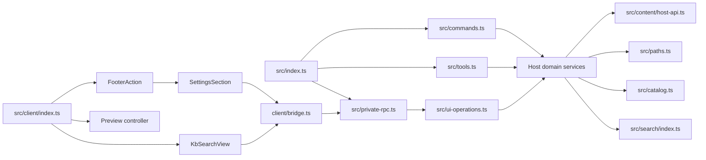

# dsh-知源源码模块化重构方案

<!-- maintained-by: human+ai -->

- **文档状态**：待评审
- **适用范围**：`src/` 下 Host、Client、content、search 代码的职责拆分
- **目标**：降低文件理解成本，明确模块边界，避免继续向大型文件堆积逻辑
- **非目标**：本方案不新增业务能力，不改变搜索协议行为、持久化格式或文件安全策略
- **分析基线**：当前工作区源码；记录提交 `8450a94`
- **工作区说明**：编写本文时工作区已有其他未提交代码、测试、构建产物和设计文档改动。后续实施必须先确认这些改动的归属，本方案不覆盖、不回滚、不替换它们。
- **修订记录**：2026-09-06 v2 —— 评审后优化目录设计：不建 `contracts/`；新增 `app/` 与 `kb/` 两层目录并收编全部散落文件；砍掉 `rpc/operations/`、`catalog/` 的过度拆分；放弃 search 内部改名；迁移不留任何 facade（含 `host-payload.ts`）；ingest 词汇统一改为 import，见名知义（文件 `import-read/check/write`，工具 `kb_import`，op 与命令同步改名）；第二轮命名清理：`identity→constants`、`host-resolve→import-dsh`、`private-rpc-contract→rpc-contract`、`ui-operations→rpc-dispatch`、`client/models→client/types`、`WorkbenchModal→Modal`、`Dialogs→BaseDialogs`、`AdditionalDialogs→ImportDialogs`。目标：改造后根目录只剩 5 个横切文件 + 5 个目录，每个文件都有唯一归属。

## 1. 背景与问题

当前 `src/` 下的文件数量已经不少，但文件名和职责并不总是一一对应。部分文件同时承担编排、参数校验、文件系统操作、格式处理和 UI 展示，阅读者需要跨越较大的代码范围才能理解一条业务链路。

本次重构要解决的不是“文件数量太少”，而是以下问题：

1. **应用编排和领域实现混在一起**：例如 `ingest.ts` 同时处理源文件遍历、hash 去重、配额、路径安全、格式转换、写入和结果汇总。
2. **页面编排和展示混在一起**：例如 `SettingsSection.tsx` 同时管理 Tab、弹框、搜索请求、预览请求和 Host 操作。
3. **边界解析集中且命名过宽**：例如 `host-payload.ts` 集中解析 read、search、ingest、table page 等不同返回值。
4. **同一类纯函数和请求组装存在重复**：command、tool、Client RPC 各自拥有部分参数校验和请求构造逻辑。
5. **领域 DTO 归属不够清晰**：`types.ts`、`content/api.ts`、`client/models.ts` 之间存在转出和交叉依赖。
6. **搜索展示存在重复编排**：设置弹框和 toolview 都有 overview/detail/hit 展示，但搜索状态逻辑分散在不同组件内。
7. **命名不见名知义**：`ingest-source.ts`、`ingest-policy.ts`、`ingest-prepare.ts` 这类“技术视角”命名读不出行为，本质上导入流水线就是 读 → 查 → 写 的过程（v2 修订：统一改为 import + read/check/write）。
8. **根目录散文件堆积**：`src/` 根目录现有 18 个散文件，入口适配器（commands/tools/private-rpc/ui-operations）、领域实现（bases/catalog/ingest）、基础设施（paths/jobs/host-resolve）和域碎片（pick-source、ingest-dropped、render-ingest）平铺在同一层，“看起来乱”的直接来源就是它。

## 2. 当前源码基线

### 2.1 文件规模

当前没有 `src/` 源文件超过 300 行，但以下文件已经接近上限或职责明显混合：

| 文件                                             | 当前规模 | 主要职责                                                   | 重构优先级 |
| ------------------------------------------------ | -------: | ---------------------------------------------------------- | ---------- |
| `src/ingest.ts`                                  |   299 行 | 导入编排、遍历、hash、配额、路径、格式准备、写入、结果汇总 | P0         |
| `src/bases.ts`                                   |   273 行 | 知识库生命周期、目录树、条目读写                           | P0         |
| `src/client/settings/styles.ts`                  |   286 行 | 注入式工作台样式字符串                                     | 暂不拆     |
| `src/client/settings/SettingsSection.tsx`        |   212 行 | 工作台状态、搜索、预览、弹框、Host 调用                    | P0         |
| `src/content/markdown/client/MarkdownEditor.tsx` |   254 行 | 编辑器生命周期、工具栏、高亮、滚动定位                     | P1         |
| `src/client/toolview/KbSearchView.tsx`           |   236 行 | toolview 搜索装配与异步状态                                | P1         |
| `src/tools.ts`                                   |   229 行 | 工具注册、参数解析、Schema、渲染                           | P1         |
| `src/client/host-payload.ts`                     |   223 行 | 多类 Host 返回值解析                                       | P1         |
| `src/content/csv/server/csv-document.ts`         |   212 行 | CSV 解析、序列化、窗口和范围处理                           | P2         |
| `src/content/csv/client/CsvPreview.tsx`          |   214 行 | CSV 预览、表格展示、编辑状态                               | P2         |
| `src/client/settings/AdditionalDialogs.tsx`      |   209 行 | 导入弹框、拖拽和相关展示                                   | P2         |

`src/client/search/SearchOverviewCard.tsx` 当前约 61 行，职责主要是搜索概览卡展示，不作为第一批拆分对象。搜索 UI 的主要重复在 `SearchDialog.tsx` 和 `KbSearchView.tsx` 的状态及列表编排层。

当前工作区已经存在一部分未提交的搜索结构整理，不能在后续实施中重复创建同一职责的模块：

- `src/client/settings/search-actions.ts` 已抽出设置工作台的搜索请求、打开文件、分页历史和过期请求处理，后续应将它视为本方案中“工作台搜索编排模块”的现有实现，先评审和完善，不再机械新增第二个 `use-workbench-search.ts`。
- `src/client/search/SearchPagination.tsx` 已抽出搜索详情的上一页/下一页展示；后续共享搜索展示时优先复用或调整该组件，不再新增同名分页组件。
- `src/client/search/search-pages.ts` 已承载搜索页历史、cursor 和分页选择相关纯逻辑。

因此，本文中的 `use-workbench-search.ts` 是职责目标名，不是要求必须新建的文件；如果现有 `search-actions.ts` 已满足该职责，应保留现有命名，避免为了目录形式进行无意义改名。

### 2.2 当前运行链路



当前 Host 的总体依赖方向是可保留的：入口负责注册，应用操作负责分派，领域模块负责业务，content/path/scanner 负责底层能力。重构重点是把每层内部的混合职责拆开，而不是重新设计整条链路。

### 2.3 当前边界事实

以下行为必须在结构重构中保持不变：

- Host 是 catalog、知识库、文件、导入任务和工具执行状态的唯一持久化真相。
- Client 只能通过 Host bridge 进行建库、导入、检索、读写和删除，不直接扫描本机文件。
- 文件路径必须继续经过库根 containment 和符号链接逃逸检查。
- `baseId`、`destCategory`、`path`、`relPath` 等字段名不得因内部改名而变化（op 值与工具名按 10.5 统一改名）。
- 搜索 v3 cursor、overview/detail 分流、scanner contract 和 result DTO 保持兼容。
- `content/host-registry.ts` 继续作为 Markdown、CSV 等格式能力的路由入口。
- Client 的 pending、error、断连、取消和过期请求处理不能在拆分中丢失。

## 3. 重构目标与原则

### 3.1 重构目标

1. 入口文件只做装配和路由，不承载大段业务实现。
2. 每个模块通过文件名表达业务职责，不使用无语义的 `utils.ts`、`helpers.ts` 等命名，优先使用 create/update/delete/read/write/check 这类直白动词。
3. 领域 DTO 只维护一份，Host 与 Client 通过明确的 contract 共享类型。
4. 纯函数、异步编排、文件系统边界和 UI 展示彼此可独立理解、测试和替换。
5. 每个阶段都能独立构建、验证和回滚，不把大量行为变更混入结构整理。
6. 根目录只保留真正的横切件；所有散落文件（域碎片、孤儿渲染器）收编进所属领域目录。

### 3.2 依赖原则

Host 方向：

```text
根目录横切件（types / RPC 契约 / 常量 / 环境探测）
    ↓
app/ 应用层（commands / tools / private-rpc / rpc-dispatch + 输入收窄与渲染）
    ↓
kb/ · search/ · content/ 领域层
    ↓
文件系统、子进程或第三方格式库
```

Client 方向：

```text
Slot 组件入口
    ↓
页面或 toolview 编排
    ↓
业务 hook
    ↓
bridge 与 payload parser
    ↓
Host RPC
```

禁止出现以下依赖：

- content 的 Client renderer 反向依赖 Client 页面模型。
- 展示组件直接调用文件系统、递归扫描或本地持久化。
- search result/template 直接调用 scanner 或读取文件。
- scanner 引入 React、Client bridge 或格式展示代码。
- 低层 path/content 模块反向依赖 settings 页面。
- `kb/`、`search/`、`content/` 领域模块反向 import `app/` 的入口适配器。

### 3.3 迁移不保留 facade

已确认暂不考虑兼容性。所有目录迁移（`kb/`、`app/`、`client/payload/`）都在同一提交内更新全部调用方与测试，旧文件直接删除，不留任何 re-export 双入口：

- `src/ingest.ts`、`src/bases.ts`、`src/catalog.ts`、`src/paths.ts`、`src/jobs.ts` 等旧文件在迁移提交中删除。
- `src/client/host-payload.ts` 拆分为 `client/payload/` 四件后同样直接删除；`test/host-payload.test.ts` 改为按新路径分文件测试。
- `src/types.ts` 是领域 DTO 的唯一真实归属，不是兼容入口，不迁移、不拆分。

每个被移动文件的 import 方不超过 6 处，调用方清单在阶段 0（T0.3）建立，保证迁移提交可一次改完并通过编译。

## 4. 目标模块结构

目录组织遵循四层依赖：根目录只保留 5 个真正的横切件，其余按“应用层 / 知识库域 / 搜索域 / 格式域 / Client”五个目录组织。改造后根目录为 5 文件 + 5 目录，所有现存文件都有明确归宿。带有“新增”标记的路径是建议路径，实施时应逐阶段落地。

```text
src/
├── index.ts                     # Host 入口：只做装配注册与生命周期清理
├── constants.ts                 # 包名、slot id、常量（原 identity.ts）
├── types.ts                     # 领域 DTO 唯一真实归属 + KbError（不建 contracts/）
├── rpc-contract.ts              # Host/Client 共享 wire 契约（原 private-rpc-contract.ts）
├── import-dsh.ts                # 定位并加载 DSH 宿主模块（原 host-resolve.ts）
│
├── app/                         # 新增：应用层——外部入口适配与输入边界
│   ├── commands.ts              # 宿主命令注册（迁移自 src/commands.ts）
│   ├── command-parse.ts         # 命令文本解析（迁移自 src/command-parse.ts）
│   ├── tools.ts                 # 工具注册，瘦身为注册与装配
│   ├── tool-input.ts            # 新增：工具参数收窄，基础校验复用 rpc-input
│   ├── tool-render.ts           # 工具结果渲染（吸收 src/render-ingest.ts）
│   ├── private-rpc.ts           # private RPC endpoint（迁移自 src/private-rpc.ts）
│   ├── rpc-dispatch.ts          # op 分派（原 ui-operations.ts，更名后见名知义）
│   └── rpc-input.ts             # 新增：共享输入校验器
│
├── kb/                          # 新增：知识库领域
│   ├── catalog.ts               # catalog 持久化（迁移自 src/catalog.ts，保持单文件）
│   ├── bases.ts                 # 库的增删改查（拆分自 src/bases.ts）
│   ├── base-tree.ts             # 新增：查目录树与统计（拆分自 src/bases.ts）
│   ├── entry.ts                 # 新增：条目读/写/删与分页（拆分自 src/bases.ts）
│   ├── paths.ts                 # 路径安全（迁移自 src/paths.ts，实现不动）
│   ├── import.ts                # 导入编排与结果汇总（拆分自 src/ingest.ts）
│   ├── import-read.ts           # 新增：读——来源遍历 + 库内 hash/大小盘点
│   ├── import-check.ts          # 新增：查——格式/配额/命名/错误码校验
│   ├── import-write.ts          # 新增：写——registry 转换 + 安全落盘
│   ├── import-drop.ts           # 拖拽导入（迁移自 src/ingest-dropped.ts）
│   ├── pick-file.ts             # 系统文件/文件夹选择框（迁移自 src/pick-source.ts）
│   └── jobs.ts                  # JobRunner 任务队列（迁移自 src/jobs.ts）
│
├── search/                      # 保持现状：不改名、不搬文件
│   ├── index.ts                 # 唯一公共入口
│   ├── scanner/
│   └── result/
│
├── content/                     # 保持现状：格式能力层
│   ├── api.ts / client-api.tsx / host-api.ts / host-contract.ts / host-registry.ts
│   ├── shared/
│   ├── markdown/
│   └── csv/
│
└── client/
    ├── index.ts                 # Client 入口
    ├── bridge.ts                # RPC 调用 + 断连处理（保持不动）
    ├── payload/                 # 新增：host-payload 按返回值拆分（旧文件直接删除）
    │   ├── read-entry.ts
    │   ├── search-result.ts
    │   ├── import-result.ts
    │   └── table-page.ts
    ├── types.ts                 # Client 类型转出与 DialogKind（原 models.ts）
    ├── settings/                # 设置工作台（页面域）
    │   ├── SettingsSection.tsx  # 瘦身为装配入口
    │   ├── BasePage.tsx / PrefsPage.tsx / AboutPage.tsx
    │   ├── dialogs/             # 新增分组：Modal / BaseDialogs / ImportDialogs / SearchDialog
    │   ├── preview/             # 保持现状
    │   ├── search-actions.ts / use-workbench-data.ts / use-entry-preview.ts
    │   ├── drop-source-path.ts
    │   └── styles.ts / Icons.tsx / SectionIcon.tsx
    ├── search/                  # 搜索展示（共享展示域）
    │   ├── hit-display.ts       # 由 client/search-utils.ts 收编改名
    │   └── Search*.tsx / search-pages.ts
    └── toolview/
        ├── KbSearchView.tsx
        ├── use-kb-search-result.ts   # 新增：搜索状态 hook
        └── preview/             # 保持现状
```

说明：旧 `src/ingest.ts`、`src/bases.ts` 等文件的删除与新 `kb/` 实现在同一提交完成，不保留同名 facade（见 3.3）。

## 4.1 目标结构职责说明

目录组织遵循四层依赖：根目录横切件（DTO、RPC 契约、常量、环境探测）→ `app/` 应用层 → `kb/`、`search/`、`content/` 领域层 → Client。所有新增模块都应先从现有实现中移动代码，再改变 import，不在移动时顺便改变业务行为；被迁移文件的调用方在同一提交内更新（见 3.3）。

### 4.1.1 根目录横切件

| 文件 | 作用 |
| --- | --- |
| `src/index.ts` | Host 插件入口，只负责依赖注入、注册和生命周期清理 |
| `src/constants.ts` | 包名、slot id、`TABLE_EDITOR_PAGE_SIZE`、`CATEGORY_WARN_DEPTH` 等常量（原 `identity.ts`——"identity" 读不出内容） |
| `src/types.ts` | 领域 DTO 唯一真实归属 + `KbError`；通过 re-export 聚合 content 与 search 类型。不另建 `contracts/`——`content/api.ts` 的格式类型属于格式契约本身，`search/result/` 的结果类型属于搜索域，新目录只会装下一半 DTO，反而造成 DTO 三个家 |
| `src/rpc-contract.ts` | Host/Client 共享的 RPC wire 契约，两侧都会 import，必须留在根目录（原 `private-rpc-contract.ts`） |
| `src/import-dsh.ts` | 定位并加载 DSH 宿主模块（peer 依赖探测），只被 `paths.ts` 引用（原 `host-resolve.ts`） |

### 4.1.2 应用层：`app/`

`app/` 收纳三个外部入口（宿主命令、模型工具、Web UI RPC）及其输入收窄与结果渲染，职责是“把不可信外部输入转成领域调用”，不承载领域实现。

| 模块 | 作用 |
| --- | --- |
| `app/commands.ts` | 宿主命令注册，转发到领域用例 |
| `app/command-parse.ts` | 命令文本解析（纯函数） |
| `app/tools.ts` | 注册 `kb_list_bases`、`kb_import`、`kb_search`，瘦身为注册与装配 |
| `app/tool-input.ts` | 新增：工具参数从 `unknown` 收窄为领域请求，基础校验复用 `rpc-input.ts` |
| `app/tool-render.ts` | 工具结果文本渲染与 presentation metadata；吸收现 `render-ingest.ts` 并随之删除 |
| `app/private-rpc.ts` | 注册 private RPC endpoint，统一序列化结果与错误 |
| `app/rpc-dispatch.ts` | `op` → 领域用例分派（原 `ui-operations.ts`，它服务的就是 RPC，原名不见名知义）；保持单文件，校验逻辑下沉 `rpc-input.ts` |
| `app/rpc-input.ts` | 新增：`asRecord`、`requireString`、`optionalString`、`optionalBoolean`、`optionalPositiveInteger`、预览选项解析等共享校验器，消除 rpc-dispatch 与 tools 的重复（背景问题 4） |

明确不做：不建 `rpc/` 目录与 `operations/` 子目录。`rpc-dispatch.ts`（原 `ui-operations.ts`）现为 197 行，抽出共享校验器后预计 120 行左右；按 op 逐个建 handler 文件只会产生 20~40 行的碎片文件，违反“目录不是为了凑数量而拆分”。

### 4.1.3 知识库领域：`kb/`

`kb/` 收纳 catalog、知识库增删改查、条目读写、路径安全、导入流水线和任务队列，是本次拆分的主要工作量。命名采用“行为视角”：库与条目按增删改查组织，导入流水线按 读（read）→ 查（check）→ 写（write）三步命名，全部见名知义。

| 模块 | 作用 |
| --- | --- |
| `kb/catalog.ts` | catalog 编解码、原子写入、单写者事务队列；保持单文件，超过 300 行或事务逻辑复杂化时再拆 codec/store/mutator |
| `kb/bases.ts` | 库的增删改查：`createBase`、`updateBase`、`deleteBase`、`listBases`、`requireBase`、`markUsed` |
| `kb/base-tree.ts` | 新增：查目录树——`listTree`、目录遍历、分类节点与文件统计（拆自 `bases.ts`） |
| `kb/entry.ts` | 新增：条目读/写/删——`readEntry`、`readEntryPage`、`writeEntryContent`、`deleteEntry`（拆自 `bases.ts`） |
| `kb/paths.ts` | 实现不动，只搬家：库根 containment、symlink 逃逸检查、`resolveDest`、`resolveDataRoot` |
| `kb/import.ts` | 导入编排：批次调度、逐文件调用、结果汇总、最近类目记忆（拆自 299 行的 `src/ingest.ts`） |
| `kb/import-read.ts` | 新增：读——`walkSource` 来源遍历、库内已有内容 hash 盘点、库大小统计 |
| `kb/import-check.ts` | 新增：查——支持格式、文件/库配额、唯一命名、错误码映射、目标路径规则 |
| `kb/import-write.ts` | 新增：写——调用 content registry 转换、重复跳过、安全落盘 |
| `kb/import-drop.ts` | 拖拽导入：聊天里拖入的文件 bytes 直接进库（原 `ingest-dropped.ts`） |
| `kb/pick-file.ts` | 弹出系统文件/文件夹选择框（原 `pick-source.ts`） |
| `kb/jobs.ts` | JobRunner 后台任务队列；目前仅服务导入任务，随导入域放置，若日后复用再上移根目录 |

命名约束：`import` 是 JS 保留字，函数与类型不能直接叫 `import`，统一用 `importFiles`、`buildImportInput`、`importDropBytes`、`ImportInput`、`ImportResult`；文件名不受限。

外部契约同步改名（兼容性已放开，见 10.6）：工具 `kb_ingest` → `kb_import`，RPC op `'ingest'` → `'import'`，命令 `ingest <path>` → `import <path>`，JobStatus 的 op 标签同步改。字段名 `baseId`、`destCategory`、`sourcePath` 等一律不变。

明确不做：不建 `catalog/` 目录（现 181 行、单一持久化单元）；不用 `base/` 目录名——与文件名 `bases.ts` 的单复数打架，统一叫 `kb/`。

### 4.1.4 搜索领域：`search/`

保持现状。`index.ts` 是唯一公共入口；scanner 只返回原始命中、warning、complete 和 stopReason；result/template 不读文件。不做 `file-search.ts → detail-search.ts` 等改名——纯改名是 churn，不降低理解成本，却改动所有 import 和测试路径。仅当 `file-search.ts`（134 行）或 `file-summary.ts` 接近 300 行时，才按需抽 `hit-builder.ts`、`search-window-policy.ts`（见 5.10）。

### 4.1.5 格式能力层：`content/`

保持现状。`api.ts` 的格式类型属于格式契约本身，不迁入 types.ts；`host-registry.ts` 继续作为格式路由入口。唯一计划内拆分是 P1 的 `MarkdownEditor.tsx`（见 5.8）。

### 4.1.6 Client bridge 与 payload：`client/payload/`

| 模块 | 作用 |
| --- | --- |
| `client/bridge.ts` | RPC 调用、断连与 Host failure 转换，保持不动 |
| `client/payload/read-entry.ts` | 新增：条目预览、编辑和定位结果解析 |
| `client/payload/search-result.ts` | 新增：overview/detail 结果与 v3 cursor 解析 |
| `client/payload/import-result.ts` | 新增：导入批次结果、warning 与失败原因解析 |
| `client/payload/table-page.ts` | 新增：CSV 表格分页、revision 与 patch 结果解析 |
| `client/host-payload.ts` | 现有文件，拆分为上述四件后直接删除，不留 facade |

不建 `bridge/` 目录：bridge 是单文件职责，payload 四件平铺命名已足够清晰。

### 4.1.7 设置工作台：`client/settings/`

页面域分组：页面组件（`SettingsSection`、`BasePage`、`PrefsPage`、`AboutPage`）留顶层；弹框收进 `dialogs/`：`Modal.tsx`（通用弹框容器，原 `WorkbenchModal.tsx`——它就是弹框，不必带 Workbench 前缀）、`BaseDialogs.tsx`（建库/编辑/删除确认弹框与 Field、Note 共用控件，原 `Dialogs.tsx`）、`ImportDialogs.tsx`（导入与拖拽弹框，原 `AdditionalDialogs.tsx`——"Additional" 读不出内容）、`SearchDialog.tsx`（不变）；`preview/` 保持现状；编排模块保持现有命名（`search-actions.ts`、`use-workbench-data.ts`、`use-entry-preview.ts`、`drop-source-path.ts`）。`SettingsSection.tsx` 按 5.7 瘦身为装配入口。

### 4.1.8 搜索展示：`client/search/`

展示组件保持现状；根目录 `client/search-utils.ts` 收编为 `client/search/hit-display.ts`——它被搜索卡片和 toolview 预览共用，归属展示域，且命名不再使用含糊的 utils。

### 4.1.9 Toolview：`client/toolview/`

按 5.9 抽取 `use-kb-search-result.ts`；`preview/` 保持现状。

## 5. 文件拆分映射

### 5.1 导入模块：`src/ingest.ts` → `kb/import*.ts`

当前文件是第一优先级。299 行按“读 → 查 → 写”拆为编排加三个步骤文件，迁移进 `kb/`；旧 `src/ingest.ts` 与其调用方 import 在同一提交内更新，不保留 facade：

| 新模块               | 负责内容                                                            | 不负责内容                 |
| -------------------- | ------------------------------------------------------------------- | -------------------------- |
| `kb/import.ts`       | 导入批次编排、逐文件调用、结果汇总、最近类目记忆                    | 具体格式解析、底层目录遍历 |
| `kb/import-read.ts`  | 单文件/目录判断、递归遍历源文件、已有文件 hash、库内大小统计        | 导入配额、目标路径策略     |
| `kb/import-check.ts` | 支持格式判断、错误码映射、相对路径、唯一文件名、导入目标路径        | 实际读取和写入             |
| `kb/import-write.ts` | 调用 content registry、处理 PreparedEntry、重复与配额判断、写入结果 | 批次遍历和 catalog 读取    |

必须保持：

- `buildImportInput`（原 `buildIngestInput`）的字段和默认值不变。
- `onConflict: 'skip'` 的语义不变。
- `existingHashes` 只表示本次导入前的库内内容快照，不引入持久化索引。
- `assertInside`、`assertNoSymlinkEscape` 和目标目录创建顺序不变。
- `copied`、`renamed`、`skipped`、`failed`、`createdDirs` 和 `warnings` 的结果结构不变。

### 5.2 知识库模块：`src/bases.ts` → `kb/`

273 行拆为三个实现文件，迁移进 `kb/`；不单独建 `file-stats.ts`，统计逻辑随 `base-tree.ts`：

| 新模块            | 建议职责                                                                         |
| ----------------- | -------------------------------------------------------------------------------- |
| `kb/bases.ts`     | `createBase`、`updateBase`、`deleteBase`、`listBases`、`requireBase`、`markUsed` |
| `kb/base-tree.ts` | `listTree`、目录遍历、分类节点和文件统计                                         |
| `kb/entry.ts`     | `readEntry`、`readEntryPage`、`writeEntryContent`、`deleteEntry`                 |

`kb/paths.ts` 继续独立负责路径解析、库根 containment 和符号链接安全，不将其复制到其他模块。

### 5.3 Catalog 模块：`src/catalog.ts` → `kb/catalog.ts`

保持单文件，只搬家不拆分。现 181 行，编解码、原子写入和变更操作共同构成一个持久化单元，拆成三个 60 行左右的文件不降低理解成本。触发拆分的条件：超过 300 行，或事务/版本兼容逻辑明显膨胀，届时再按 codec、store、mutator 拆分。

原子写入和单写者队列属于持久化安全边界，即使只搬家，也先确认 `test/catalog.test.ts` 覆盖行为等价，再移动实现。

### 5.4 RPC 操作：`src/ui-operations.ts` → `app/rpc-dispatch.ts`

现 197 行，不建 `rpc/` 目录，只做两件事：

| 新模块                 | 建议职责                                                                                                              |
| ---------------------- | --------------------------------------------------------------------------------------------------------------------- |
| `app/rpc-input.ts`     | 新增：`unknown` 输入转 `JsonRecord`、字符串/布尔值/正整数/字符串数组校验、预览选项解析；供 rpc-dispatch 与 tools 共用 |
| `app/rpc-dispatch.ts`  | `op` 分派与各领域用例装配（更名自 `ui-operations.ts`），抽出校验器后预计 120 行左右                                   |

不逐 op 拆 handler 文件：每个 handler 只有 20~40 行，`operations/` 子目录是过度碎片化。`rpc-dispatch.ts` 若未来超过 300 行，再按领域拆分。

### 5.5 工具注册：`src/tools.ts` → `app/`

现 229 行，不建 `tools/` 目录，拆两件并收编孤儿文件：

| 新模块               | 建议职责                                                        |
| -------------------- | --------------------------------------------------------------- |
| `app/tools.ts`       | 注册 `kb_list_bases`、`kb_import`、`kb_search`                  |
| `app/tool-input.ts`  | 工具参数收窄、请求对象构造                                      |
| `app/tool-render.ts` | 工具结果文本和展示 metadata；吸收 `render-ingest.ts` 并随之删除 |

工具的参数字段、结果字段和错误行为保持兼容；工具名按 10.6 统一改名。不要在拆工具注册时同时修改 search result template。`search-schema.ts` 不单独建文件，Schema 留在注册处。

### 5.6 Client payload：`src/client/host-payload.ts` → `client/payload/`

按返回值类型拆分，平铺在 `client/payload/`，不建 `bridge/` 目录：

```text
src/client/payload/read-entry.ts
src/client/payload/search-result.ts
src/client/payload/import-result.ts
src/client/payload/table-page.ts
```

基础 guard 逻辑内联在各 parser；业务 parser 负责完整收窄和可理解的错误信息。拆分后 `host-payload.ts` 直接删除：Client 组件与 `test/host-payload.test.ts` 在同一提交改用新路径（测试按 payload 类型分文件），不留 facade。

### 5.7 设置工作台：`SettingsSection.tsx`

当前组件应逐步变成页面装配入口；弹框组件收进 `client/settings/dialogs/` 分组：

| 模块                                           | 建议职责                                                                                                                            |
| ---------------------------------------------- | ----------------------------------------------------------------------------------------------------------------------------------- |
| `src/client/settings/search-actions.ts`        | 搜索请求、请求版本、取消/过期响应、overview/detail、分页、打开文件和返回概览（现有模块，优先完善，不新建 `use-workbench-search.ts`） |
| `src/client/settings/use-workbench-actions.ts` | 新增：创建、编辑、删除、导入、偏好保存等异步动作                                                                                    |
| `src/client/settings/dialogs/`                 | `Modal.tsx`（弹框容器）、`BaseDialogs.tsx`（建库/编辑/删除确认 + Field、Note）、`ImportDialogs.tsx`（导入与拖拽）、`SearchDialog.tsx` |
| `src/client/settings/SettingsSection.tsx`      | Tab、页面布局、hook 组合、组件回调连接                                                                                              |

必须保持：

- 请求版本号或 AbortController 能阻止旧结果写回当前状态。
- Host 未确认前，Client 不把本地 draft 当作已持久化。
- `pending`、`error`、断连和失败重试状态继续可见。
- 删除知识库、删除文件和导入等高影响操作继续需要确认或必填项。

### 5.8 Markdown 编辑器：`src/content/markdown/client/MarkdownEditor.tsx`

建议拆分为：

```text
src/content/markdown/client/MarkdownEditor.tsx   # Tiptap 生命周期和整体装配
src/content/markdown/client/MarkdownToolbar.tsx   # 工具栏展示和事件
src/content/markdown/client/markdown-highlight.ts # 命中行、匹配和纯计算
src/content/markdown/client/markdown-scroll.ts    # TreeWalker、mark、滚动和清理
```

编辑器实例、imperative handle 和 cleanup 仍由 `MarkdownEditor.tsx` 统一管理，避免多个模块重复销毁 Tiptap 实例。

### 5.9 Toolview 搜索：`KbSearchView.tsx`

建议新增：

```text
src/client/toolview/use-kb-search-result.ts
src/client/toolview/tool-result-types.ts
```

hook 负责 tool block 解析、AbortController、active result、overview/detail、分页和打开文件动作；`KbSearchView.tsx` 只负责 loading/error/overview/detail 的展示分发。

### 5.10 Search Host 内部：不做改名

当前 `src/search/index.ts` 已经适合作为唯一公共入口，`search/` 整体保持现状。`file-search.ts`（134 行）到 `detail-search.ts` 之类的改名属于纯 churn：文件名与职责已经对应，改名不降低理解成本，却改动所有 import 和测试路径。

仅当以下条件触发时才做内部细化：

| 触发条件                               | 动作                                                     |
| -------------------------------------- | -------------------------------------------------------- |
| `file-search.ts` 接近 300 行           | 抽 `hit-builder.ts`（命中窗口、字符预算、命中 DTO 构造） |
| `file-summary.ts` 接近 300 行          | 抽 `search-window-policy.ts`（窗口合并与预算纯函数）     |
| 确认 `result/templates` 存在无调用导出 | 清理旧导出，不搬家                                       |

scanner 只返回原始命中、warning、complete 和 stopReason；result/template 不读取文件、不启动 scanner。

### 5.11 CSV 和样式

`src/content/csv/server/csv-document.ts` 和 `src/content/csv/client/CsvPreview.tsx` 属于第二阶段之后的拆分对象。它们涉及 CSV 分页、revision、稀疏 patch 和编辑状态，不能为了减少行数而引入第二套解析模型。

`src/client/settings/styles.ts` 当前主要是一份连续的注入 CSS，不建议现在拆成多个文件。只有在新增样式导致其超过边界时，才按 base/search/preview/dialog 分片，并保留一个统一拼接入口。

## 6. 分阶段实施计划

### 阶段 0：基线和契约冻结

**目标**：在任何移动代码前确认行为边界。

工作项：

- 记录 Host/Client 入口、RPC endpoint、slot 名、工具名和搜索 cursor 结构。
- 记录当前未提交改动，明确本次重构不覆盖已有改动。
- 对 `src/` 文件做当前行数快照。
- 运行现有测试、构建和 diff 检查，作为重构前基线。
- 建立每个计划移动文件的调用方清单（app 侧入口文件与 test）。

完成标准：能说明每个移动文件的调用方数量，并能在失败时回滚单个阶段。

### 阶段 1：`kb/` 领域迁移与拆分

**目标**：先处理最接近 300 行、职责最混合的 Host 领域文件。

建议顺序：

1. 建目录 `kb/`，整体搬家不改实现：`catalog.ts`、`paths.ts`、`jobs.ts`、`ingest-dropped.ts`（更名 `import-drop.ts`）、`pick-source.ts`（更名 `pick-file.ts`）。
2. 拆 `src/ingest.ts`（299 行）→ `kb/import.ts` + `import-read.ts` + `import-check.ts` + `import-write.ts`。
3. 拆 `src/bases.ts`（273 行）→ `kb/bases.ts` + `base-tree.ts` + `entry.ts`。
4. 同一提交内更新调用方（`index.ts`、`commands.ts`、`tools.ts`、`private-rpc.ts`、`ui-operations.ts` 与对应 test），删除旧文件，不留 facade。

本阶段重点回归：path containment、symlink 检查、catalog 原子写入与单写者队列、导入 hash 去重、配额、JobRunner 和错误码。

### 阶段 2：`app/` 应用层迁移

**目标**：把外部入口适配与领域实现分层。

建议顺序：

1. 建目录 `app/`，搬家：`commands.ts`、`command-parse.ts`、`tools.ts`、`private-rpc.ts`、`ui-operations.ts`（更名 `rpc-dispatch.ts`）。
2. 抽 `app/rpc-input.ts` 共享校验器，`rpc-dispatch.ts` 与 `tools.ts` 改为复用。
3. 抽 `app/tool-input.ts`；`render-ingest.ts` 并入 `app/tool-render.ts` 后删除。
4. 删除 `rpc-dispatch.ts`、`tools.ts` 中与 `rpc-input.ts` 重复的校验代码。
5. 外部命名统一（兼容性已放开）：工具 `kb_ingest` → `kb_import`，RPC op `'ingest'` → `'import'`，命令 `ingest <path>` → `import <path>`，JobStatus 的 op 标签同步改；`kb_list_bases`、`kb_search` 不变。
6. 根目录改名：`identity.ts` → `constants.ts`、`host-resolve.ts` → `import-dsh.ts`、`private-rpc-contract.ts` → `rpc-contract.ts`，同一提交更新 Host 与 Client 引用。

本阶段不修改：RPC 字段名（`baseId`、`destCategory` 等）、工具 Schema 结构、命令语法格式。

### 阶段 3：Client payload 与 settings 分组

**目标**：减少 Client 边界解析集中和页面目录拥挤。

工作项：

1. 拆 `host-payload.ts` → `client/payload/` 四件，同一提交更新 Client 组件与测试 import，删除旧文件。
2. 确认无运行时循环依赖；`test/host-payload.test.ts` 按 payload 类型分文件迁移。
3. `settings/` 弹框收进 `dialogs/` 并改名：`WorkbenchModal.tsx` → `Modal.tsx`、`Dialogs.tsx` → `BaseDialogs.tsx`、`AdditionalDialogs.tsx` → `ImportDialogs.tsx`；`search-utils.ts` 改名 `client/search/hit-display.ts`；`client/models.ts` 更名 `client/types.ts`。
4. 抽 `toolview/use-kb-search-result.ts`（含 `tool-result-types.ts`）。
5. 评审现有 `search-actions.ts` 是否完整覆盖搜索编排，必要时补齐，不新建第二套状态机。
6. Client 同步外部命名：`SettingsSection.tsx` 的 `op: 'ingest'` 改为 `'import'`；`IngestResult` 等类型更名 `ImportResult`。

本阶段重点检查：`unknown` 收窄、断言位置、AbortController 与过期请求保护不被丢失。

### 阶段 4（可选 P1）：Markdown 编辑器拆分

拆 `MarkdownEditor.tsx` 的 toolbar、highlight、scroll（见 5.8）。Tiptap 实例与 cleanup 仍由 `MarkdownEditor.tsx` 统一管理。

### 阶段 5：DSH 座椅契约单独处理

当前代码使用 `sidebar.footer.action` 创建工作台 overlay，而当前插件契约要求工作台使用已有的 typed `settings.section`，`id` 为 `knowledge`、`label` 为“知源”。这是独立的行为和宿主契约变更，不属于普通模块拆分。

如需实施，必须单独完成：

- 确认目标 DSH 版本提供的实际 slot 类型和生命周期。
- 迁移工作台入口，避免保留第二套工作台。
- 移除对壳私有 DOM 的依赖。
- 单独执行安装、激活和 web runtime 验证。
- 不与大量 Host/Client 文件移动放在同一个不可审查的大提交中。

## 7. 第一批建议范围

第一批覆盖阶段 1 与阶段 2（Host 侧全部），Client 侧只做风险最低的 payload 拆分：

```text
阶段 1（kb/）：
  src/catalog.ts、paths.ts、jobs.ts、ingest-dropped.ts→import-drop.ts、pick-source.ts→pick-file.ts → 搬家
  src/ingest.ts → kb/import.ts + import-read.ts + import-check.ts + import-write.ts
  src/bases.ts → kb/bases.ts + base-tree.ts + entry.ts

阶段 2（app/）：
  src/commands.ts、command-parse.ts、tools.ts、private-rpc.ts、ui-operations.ts→rpc-dispatch.ts → 搬家
  新增 app/rpc-input.ts、app/tool-input.ts
  src/render-ingest.ts → app/tool-render.ts（吸收后删除）
  外部命名统一：kb_ingest→kb_import、op 'ingest'→'import'、命令 ingest→import
  根目录改名：identity→constants、host-resolve→import-dsh、private-rpc-contract→rpc-contract

阶段 3 前置（client/）：
  src/client/host-payload.ts → client/payload/ 四件（同提交删除旧文件）
```

第一批明确不做：

- 不修改 `SearchOverviewCard.tsx` 的展示结构。
- 不改变 `search/index.ts` 的外部入口，不改 search 内部文件名。
- 不改变 RPC payload 字段与工具 Schema 结构（外部命名统一见 10.6）。
- 不改变 catalog JSON 结构。
- 不改变 Host/Client 的数据所有权。
- 不迁移 `settings.section`。
- 不手工修改 `lib/` 生成物。
- 不保留任何兼容 facade（见 3.3）。

## 8. 验收标准

### 8.1 结构验收

- 入口文件只保留注册、装配和薄路由。
- 新文件名能表达业务职责，React 组件使用 PascalCase，普通 TypeScript 模块使用 kebab-case。
- `src/` 下每个实现文件保持在 300 行以内，并且不是通过压缩空行或机械切碎实现。
- 领域 DTO 只有一个真实定义（`types.ts`），迁移不保留任何兼容 facade。
- `src/` 根目录只保留横切文件与目录，不残留领域实现或域碎片文件。
- 不出现 Client → 文件系统、展示组件 → Host 领域实现的越层依赖。
- 不出现新的循环依赖或未清理的旧导出。

### 8.2 行为验收

- 建库、更新、删除、导入、读写、搜索、分页和偏好功能行为不变。
- `baseId`、`destCategory`、`path`、`relPath` 等字段名不变；op 值与工具名按 10.6 完成统一改名。
- 导入的重复跳过、重命名、配额、路径安全和错误码不变。
- 搜索 overview/detail、v3 cursor、scan warning、分页和 preview fallback 不变。
- Client 的 pending、error、断连、取消和过期响应保护不变。
- 所有 effect、timer、listener、observer、editor 实例和 slot 注册仍然可清理。

### 8.3 工程验证

每个阶段完成后执行：

```sh
npm test
npm run build
git diff --check
```

此外检查：

```sh
# 确认源码文件规模
find src -type f \( -name '*.ts' -o -name '*.tsx' \) -print0 | xargs -0 wc -l

# 确认生成物由构建同步，不手工编辑 lib
npm run build
```

涉及插件契约、安装或 Client 激活时，再单独执行：

```sh
dsh plugin --profile web add .
dsh --profile web --dump-config
dsh web
```

这三类结果必须分别记录为：实现验证、安装/激活验证、运行时验证。没有实际执行的检查只能标记为待测。

## 9. 风险与回滚策略

| 风险                     | 可能表现                    | 预防方式                             | 回滚方式                         |
| ------------------------ | --------------------------- | ------------------------------------ | -------------------------------- |
| 迁移提交遗漏调用方       | 旧调用方编译失败            | 迁移前建立调用方清单，先跑 build     | 按文件恢复本次变更               |
| 外部改名遗漏引用点       | Client 或工具调用失败       | 按 10.6 建立改名清单，全局搜索旧名   | 恢复旧工具名/op 值，不影响拆分   |
| 异步请求旧结果写回       | 搜索结果或预览错位          | 保留 request version/AbortController | 恢复原 hook，保留纯展示拆分      |
| 路径安全逻辑被重复实现   | symlink 或 containment 回归 | 所有路径操作继续集中走 `kb/paths.ts` | 删除新 adapter，恢复原调用       |
| catalog 写入顺序变化     | 数据丢失或并发覆盖          | 先测试原子写入和单写者队列           | 回退 `kb/catalog.ts` 迁移        |
| 类型归属调整引入循环依赖 | 构建或运行时加载异常        | type-only import，逐步迁移           | `types.ts` 本方案不迁移，恢复原状 |
| Client slot 误改         | 工作台不显示或重复显示      | 将座椅迁移单独成变更                 | 只回退 slot 注册，不影响领域拆分 |
| 工作区已有改动被覆盖     | 无关功能回退                | 只修改本阶段文件，提交前检查 diff    | 按文件恢复本次变更               |

## 10. 评审决策点

开始实施前需要确认以下事项：

1. 已定：暂不考虑兼容性，迁移不留任何 facade（含 `host-payload.ts`），调用方与测试随迁移提交直接更新。
2. 已定：不建 `contracts/`，`types.ts` 是唯一 DTO 归属。
3. 已定：不建 `rpc/operations/`、`catalog/`、`tools/` 目录；改为 `app/` + 共享校验器、`kb/catalog.ts` 单文件、`app/tool-render.ts` 平铺。
4. 已定：放弃 `search/` 内部改名（file-search → detail-search 等），仅在文件接近 300 行时按需细化。
5. 已定：ingest 词汇统一改为 import，见名知义——文件 `kb/import.ts` + `import-read/check/write`，工具 `kb_import`，op `'import'`，命令 `import <path>`，类型 `ImportResult`；`import` 是保留字，函数用 `importFiles` 等形式；字段名 `baseId`、`destCategory` 等不变。
6. 已定：第二轮命名清理——`identity→constants`、`host-resolve→import-dsh`、`private-rpc-contract→rpc-contract`、`ui-operations→rpc-dispatch`、`client/models→client/types`、`WorkbenchModal→Modal`、`Dialogs→BaseDialogs`、`AdditionalDialogs→ImportDialogs`；`catalog`、`jobs`、`bridge`、search 与 content 内部维持现名。
7. 待定：DSH `settings.section` 迁移是否作为独立任务处理。
8. 待定：当前工作区已有未提交改动的归属和合并顺序。

## 11. 实施提交建议

每个结构重构提交只包含一个主要职责域，例如：

```text
refactor(kb): move catalog/paths/jobs into kb/ and split import pipeline
refactor(app): extract shared rpc input validation and tool rendering
refactor(client): split host payload by result kind and group dialogs
refactor(markdown): separate editor toolbar and highlight logic
```

提交不应同时包含：

- 新业务能力。
- 搜索协议调整。
- 依赖升级。
- DSH slot 迁移。
- 无关的格式化或生成物手工修改。

## 12. 重构执行 TODO

> 执行规则：每个阶段先完成源码阅读和调用方清单，再移动实现；每个 TODO 完成后单独运行验证。未完成项保持未勾选，不把“已写方案”当成“已完成代码”。

### 12.1 阶段 0：基线冻结与工作区确认

- [ ] **T0.1 确认工作区改动边界**：整理当前未提交文件清单，确认 `search-actions.ts`、`SearchPagination.tsx`、`search-pages.ts` 等已有改动的归属和保留策略。
- [ ] **T0.2 建立源码规模快照**：记录 `src/` 下所有 `.ts`、`.tsx` 文件行数，标出超过 220 行和超过 280 行的文件。
- [ ] **T0.3 建立调用方清单**：记录计划移动文件（ingest、bases、catalog、paths、jobs、pick-source、ingest-dropped、commands、command-parse、tools、render-ingest、private-rpc、ui-operations、host-payload、search-utils）的 import 方清单。
- [ ] **T0.4 冻结外部契约**：记录 RPC `op`、`baseId`、`destCategory`、`path`、`relPath`，工具名、工具 Schema、搜索 v3 cursor 和 content registry 扩展名；标注 10.5/10.6 中待改名的项（`kb_ingest`、op `'ingest'`、命令 `ingest`）。
- [ ] **T0.5 执行重构前基线验证**：运行 `npm test`、`npm run build`、`git diff --check`，记录结果，不修改生成物来掩盖基线问题。

**阶段 0 完成标准**：工作区已有改动已区分；所有计划移动文件的调用方有清单；基线验证结果可追溯。

### 12.2 阶段 1：`kb/` 领域迁移与拆分

- [ ] **T1.1 整体搬家（不改实现）**：`catalog.ts`、`paths.ts`、`jobs.ts` 移入 `kb/`；`ingest-dropped.ts` → `kb/import-drop.ts`、`pick-source.ts` → `kb/pick-file.ts`；同一提交更新调用方与 test import，删除旧文件。
- [ ] **T1.2 拆 `src/ingest.ts`**：迁移为 `kb/import.ts`、`kb/import-read.ts`、`kb/import-check.ts`、`kb/import-write.ts`，函数更名 `importFiles`、`buildImportInput` 等。
  - 先迁移纯函数，再迁移单文件导入，最后迁移批次编排。
  - 保持 hash 去重、重命名、配额、目录创建、错误码和结果汇总行为。
- [ ] **T1.3 拆 `src/bases.ts`**：迁移为 `kb/bases.ts`、`kb/base-tree.ts`、`kb/entry.ts`。
  - 不复制 `kb/paths.ts` 的 containment 和 symlink 安全逻辑。
  - 保持 catalog 更新和文件操作的先后顺序。
- [ ] **T1.4 验证 catalog 搬家**：确认原子写入与单写者队列行为等价（`test/catalog.test.ts`）。
- [ ] **T1.5 完成 kb 阶段验证**：运行测试、构建和 diff 检查；重点验证路径安全、导入失败恢复、配额和错误码。

**阶段 1 完成标准**：`kb/` 目录内所有文件单一职责且低于 300 行，`src/` 根目录不再有知识库领域散文件，无 facade 残留。

### 12.3 阶段 2：`app/` 应用层迁移

- [ ] **T2.1 整体搬家与改名**：`commands.ts`、`command-parse.ts`、`tools.ts`、`private-rpc.ts`、`ui-operations.ts`（→`rpc-dispatch.ts`）移入 `app/`；`identity.ts` → `constants.ts`、`host-resolve.ts` → `import-dsh.ts`、`private-rpc-contract.ts` → `rpc-contract.ts`；更新 `index.ts`、Client 与 test import。
- [ ] **T2.2 抽 `app/rpc-input.ts`**：共享 `asRecord`、`requireString`、`optionalString`、`optionalBoolean`、`optionalPositiveInteger`、`readPreviewOptions`；`rpc-dispatch.ts` 与 `tools.ts` 复用，删除重复实现。
- [ ] **T2.3 抽 `app/tool-input.ts`**：工具参数收窄独立成模块。
- [ ] **T2.4 合并 `render-ingest.ts`**：并入 `app/tool-render.ts` 后删除旧文件。
- [ ] **T2.5 外部命名统一**：工具 `kb_ingest` → `kb_import`，op `'ingest'` → `'import'`，命令 `ingest <path>` → `import <path>`，JobStatus op 标签同步改；`kb_list_bases`、`kb_search` 名称、参数结构、结果字段和错误行为不变。
- [ ] **T2.6 完成 app 阶段验证**：运行测试、构建和 diff 检查。

**阶段 2 完成标准**：三个外部入口与领域实现分层清晰，外部命名已统一，`src/` 根目录只剩横切件与目录。

### 12.4 阶段 3：Client payload 与 settings 分组

- [ ] **T3.1 拆分 Client payload parser**：`host-payload.ts` 按 read entry、search result、import result、table page 拆入 `client/payload/`。
- [ ] **T3.2 更新调用方与测试**：Client 组件与 `test/host-payload.test.ts` 改用 `client/payload/` 新路径（测试按 payload 类型分文件），同一提交删除 `host-payload.ts`，不留 facade。
- [ ] **T3.3 settings 目录分组与改名**：弹框收进 `client/settings/dialogs/`（`WorkbenchModal` → `Modal`、`Dialogs` → `BaseDialogs`、`AdditionalDialogs` → `ImportDialogs`）；`search-utils.ts` 改名 `client/search/hit-display.ts`；`client/models.ts` 改名 `client/types.ts`。
- [ ] **T3.4 抽 toolview 搜索状态**：`KbSearchView.tsx` 抽出 `use-kb-search-result.ts` 与 `tool-result-types.ts`，保留 AbortController 与 preview controller 生命周期。
- [ ] **T3.5 整理设置工作台动作**：以现有 `search-actions.ts` 为基础评审搜索编排；如需 hook 化只做一次迁移，不保留两套状态机。
- [ ] **T3.6 检查依赖方向与循环依赖**：Client payload 只依赖 bridge 与类型；仅用于类型的依赖改为 `import type`。
- [ ] **T3.7 同步 Client 外部命名**：`SettingsSection.tsx` 的 `op: 'ingest'` 改 `'import'`；`IngestResult` 等类型更名 `ImportResult`。
- [ ] **T3.8 完成边界验证**：覆盖 malformed JSON、缺少字段、错误类型、未知 result kind、断连和 Host failure。

**阶段 3 完成标准**：领域 DTO 只有一份真实定义，payload 解析按返回值分文件，wire contract 与改名清单一致，未保留任何 facade。

### 12.5 阶段 4（可选）：Markdown 编辑器拆分

- [ ] **T4.1 拆 Markdown 编辑器纯逻辑**：提取 `MarkdownToolbar.tsx`、`markdown-highlight.ts`、`markdown-scroll.ts`；Tiptap 实例、imperative handle 与 cleanup 留在 `MarkdownEditor.tsx`。
- [ ] **T4.2 完成 Client 阶段验证**：运行测试、构建和 diff 检查；手工检查正常、空、加载、错误和分页状态。

**阶段 4 完成标准**：编辑器文件低于 300 行，行为与清理路径不变。

### 12.6 阶段 5：DSH 座椅契约独立任务

- [ ] **T5.1 确认目标 DSH 版本的 typed `settings.section` 能力和生命周期。**
- [ ] **T5.2 设计工作台从 footer overlay 到 `id: knowledge`、`label: 知源` 的迁移，不保留第二套工作台。**
- [ ] **T5.3 移除对壳私有 DOM、details 布局属性和自建宽度观察器的依赖。**
- [ ] **T5.4 单独验证 slot 注册、卸载、Client lazy-CJS 和 React 外置依赖。**
- [ ] **T5.5 单独执行安装、激活和运行时检查，不与大规模文件移动混在同一提交。**

**阶段 5 完成标准**：工作台使用正式 typed slot，注册和卸载行为明确，`dump-config` 和 web runtime 结果可记录。

### 12.7 每个重构任务的通用完成清单

- [ ] 已阅读被拆文件及其所有直接调用方。
- [ ] 已确认导出物、RPC 字段、工具参数或 content contract 没有被内部改名破坏。
- [ ] 新模块只有一个主要职责，文件名能表达业务含义。
- [ ] 异步任务有失败处理、取消处理和过期结果保护。
- [ ] React effect、timer、listener、observer 和 editor 实例有 cleanup。
- [ ] Client 显示了适用的 idle、pending、error、断连、空态和正常态。
- [ ] `src/` 下相关文件没有超过 300 行。
- [ ] 已运行 `npm test`、`npm run build`、`git diff --check`。
- [ ] 已检查本次 diff 没有混入无关格式化、生成物手改或业务功能。
- [ ] 若涉及插件契约，已分别记录实现、安装/激活、运行时验证结果。

---

## 结论

本方案建议先做“保持行为的结构整理”，而不是一次性重写架构。目标目录形态：根目录只留 5 个横切件，`app/` 承载外部入口适配，`kb/` 收纳知识库领域并把 `ingest.ts` 按读（import-read）→ 查（import-check）→ 写（import-write）拆开、`bases.ts` 按库/树/条目拆开，Client 侧按 payload/settings/search/toolview 分域。迁移不保留任何 facade；`contracts/`、`rpc/operations/`、`catalog/` 目录与 search 改名均明确不做；ingest 词汇统一改为 import；含糊命名（identity、host-resolve、ui-operations、models、WorkbenchModal、AdditionalDialogs 等）全部按“见名知义”清理。DSH 座椅迁移和其他行为变化单独隔离。这样每一步都能通过构建、测试和 diff review 判断是否只发生了模块边界变化。

---

<!-- PKB-metadata
last_updated: 2026-09-06
commit: 8450a94
updated_by: human+ai
review_status: pending
review_score: 0
reviewed_by:
confidentiality: L1
-->
